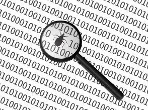

我们在做持续集成的时候，或者说是在做连续测试的时候，目的是为了让代码健康，健壮有效。其中，持续交付CD和持续部署能够让运维人员快速的随时随地的将代码推送到线上。而随着devops推进中，生产环境中开发人员需要自己解决代码bug问题，开发人员需要立即知道他们正在进行修改的代码会有那些问题。

## 连续测试

唯一保证代码良好的方式就是测试他们，这也是我们进行持续测试原因。在进行这种转变或者参与的团队中，性能测试和自动化测试从早先的测试工作转变为促进测试到开发人员个人测试，维持提供支持和协作。每个人都构建他们的代码，每个人也进行不断的测试自己的代码。

但持续测试成为新的常态中。测试将变得更加灵活，测试人员或者开发人员配置了功能测试和测试工具，并且能够对任何新的修改或者更新进行单元测试。并且随测试到预生产环节，在到生产环节，甚至到上线后的监控等。团体只需要最短的时间来怎么代码的可用性并且可以接收新流量。

连续测试的过程中会出现很多未曾出现的问题，必然是充满挑战。我们必须确保如下几点：

### 尽早的定义好测试

我们需要有明确的需求来定制测试，并且使用行为驱动开发BDD,验收测试驱动开发ATDD和使用工具基于模型的测试，以便于清晰的记录和传达所有需求。

为了避免浪费不必要的时间和延误。至少需要明确需求后定义测试用例和测试脚本，以便于在生产的每个阶段都能够进行连续测试代码。

### 优化测试流程和测试覆盖率

仅测试需要测试的内容，删除不必要的重复项，对时间较久的测试环节采用旁路测试，在不影响管道运行的情况下精简。

测试最大的覆盖范围就需要可视化的模型。

### 早期和后期

测试在开发周期早期准备，开发人员/测试人员准备好测试工具和用例或者脚本，包括但不局限自动化测试，功能测试，性能测试，监控，安全测试等。必须满足易于开发，方便使用和采用。

生产环境中仍然需要后期跟踪，包括代码检测，持续监控，用户监控，蓝绿发布等。

### 环境一致性

提供虚拟化测试环境的能力对于实现持续测试至关重要。通过一些列工具ci/cd，在被需要提供的情况下，提供完整的测试环境。这些环境中应该包括按需测试的数据，以确保团队可以使用与生产环境中类似的参加执行全面测试。

这些环境的构建是暂时性的。在使用完成后就会被释放。

### 获取真实的测试数据

如果不能够获取真是的测试数据可能会导致应用程序发布更新出现延迟。新的更新大多建立在旧的代码智商，要尽可能的接近应用程序在生产中遇到的内容。如果缺乏某些特征，则测试不太可能主动发现需要潜在问题和bug。如何提取这些数据，也是一个值得讨论的话题。

对于这些生产中的真实数据，通常来说都需要限制。在被采用的时候屏蔽一些敏感信息，同时还要保持生产数据测试所需的特性。

## 最后

持续交付和持续测试需要时间才能成功实施。在团队中，基于数据的持续反馈和正确的工具集可以较少不必要的麻烦。

## 其他阅读

- [Devops](https://www.linuxea.com/category/devops/)
- [docker](https://www.linuxea.com/2394.html)

