通常我们指容器而是一个容納其它物品的[工具](https://zh.wikipedia.org/wiki/%E5%B7%A5%E5%85%B7)，可以部份或完全封閉，被用於容納、儲存、運輸物品[[3\]](https://zh.wikipedia.org/wiki/%E5%AE%B9%E5%99%A8#cite_note-3)。物體可以被放置在容器中，而容器則可以保護內容物。我们参考：https://zh.wikipedia.org/wiki/%E5%AE%B9%E5%99%A8

## 虚拟化

我们知道常规虚拟化的形式，主流的有两种。

第一种主机级虚拟化，虚拟整个完整的物理平台。比如vmwarer，vmware创建的虚拟机就像一个完整的物理一样。可在之上安装不同的虚拟机，虚拟机系统。其中也有两种类型的实现。

类型一：直接在硬件平台安装虚拟机管理器，Hypervisor。也就是说没有任何主机是运行在硬件之上的，所有的主机都是跑在虚拟机上。

类型二：包含vmwaer workstation，virtualbox。需要在物理机之上先安装host os，也就是宿主机系统。在宿主机智商安装vmware，在vmwaer之上在创建虚拟机。

这种的实现机制方式如下：

首先是底层硬件平台，暂且不管主机级虚拟化是Host os还是其他，虚拟出的环境是一个独立的硬件平台。用户要使用虚拟机，就需要在虚拟机之上部署一个完整意义的操作系统，系统中必然是有内核，内核中也会有用户空间，用户空间运行进程。

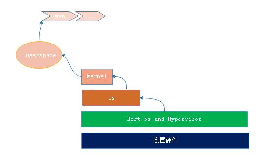

但是，运行内核只是让内核完成资源分配，内核中运行的应用程序才是我们最终要的。如：提供的web应用nginx，httpd等。都是运行在用户空间的应用进程。而这些应用进程产生生产力的才是我们想要的，而不是出于通用目的设计的资源管理平台的系统内核。但是这个内核，不得不有，在硬件平台上使用应用程序都是根据内核调用和库调用研发，没有这些内核环境是无法运行应用程序的。并且在用户空间内进程协调也必须要内核来实现。假如创建的虚拟机就只有一个单一的目的，如：tomcat。但是要运行tomcat就必须要虚拟出硬件，安装操作系统安装环境后运行，这样的消耗无疑是很大的。

如果用虚拟化二类型来看，一个进程需要运行需要实现两级调度和资源分配。虚拟机本身的内核就已经是一次内存虚拟化，CPU调度。io调度管理等等。而虚拟机本身也是被宿主机内核管理另一层虚拟化(或者Hypervisor)管理调度一次，这中间无疑是浪费。

传统的虚拟化技术，可以在一组硬件平台之上实现所谓的跨系统环境隔离，调用，高效应用等等。但是资源的开销也是很大。

## 容器

既如此，减少中间层的环节是有效提供效率的方式。如果此时将虚拟机os这层抽取掉，只保留进程。那这样也是有问题的，资源隔离就是问题。

> 虚拟机可完成环境隔离。如：一台主机是不能使用相同的套接字端口的。而虚拟机就可以进行隔离实现的。并且不会影响到其他主机

而资源隔离才是我们想要的。因此就算抽取掉中间os内核，也需要做到每一组进程彼此之间是互相不可达，和虚拟机物理机一样的互不干扰，仅仅共享使用同样的底层资源而已，这种资源隔离是需要实现的。

那这样的话，环境就可能变成这样.

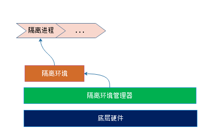

首先，有硬件平台，在硬件平台之上提供所谓的虚拟的隔离环境管理器，而后创建隔离环境，隔离的进程就运行在隔离环境内。如上图。

但是，进程运行在用户空间，内核提供的是内核空间，用户空间要运行在隔离环境中。事实上隔离的就是用户空间。用户空间被隔离成多组，彼此之间互不干扰，一个空间运行部分进程或者一个。但是不管如何隔离，其中必然会有一个，或者第一个是进行管理其他用户空间的。

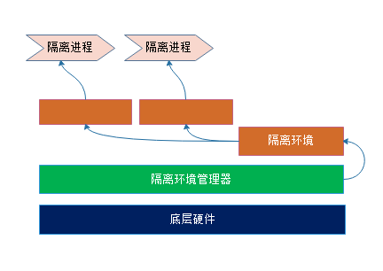

随后启动进程的时候，进程运行在用户空间当中。众多用户空间共享底层同一个内核。但是在运行时候看到的边界，是自己所属用户空间的边界。

这种隔离是没有主机虚拟化隔离的那么彻底，而且隔离的用户空间是用来放进程的，给进程提供运行环境，同时保护内部进程不会其他进程干扰，这种方式就称为容器技术。

## namespace

容器技术出现较早，最早**FreeBSD**的操作系统虚拟化，其目的就是为了让进程不受其他干扰。就算这个经常出现了某些故障，bug，以及异常行为也不会影响到容器边界之外的其他进程，破坏的边界也是此jail而已。这种隔离可使应用安全运行。

这种技术被用到linux后，叫VServer，VServer也能实现一定的jail的效果，vserver实现的功能chroot，**chroot**将正在运行的进程限制在主机文件系统中的子目录中。在该过程中，它将目录视为其文件系统的根（/）。它只能访问chroot环境中的文件。如果是root用户，当然可以为所欲为。

但是FreeBSD的**jails**比chroot更安全，因为它们还对某些管理操作提供了一些限制，例如挂载和卸载文件系统，无法访问路由表或原始套接字，没有修改内核参数和sysctl等。

在一个单独的用户空间中，主要的目的是实现隔离环境，任何一个用户运行在当中就会以为自己是唯一一个运行在当前内核之上用户空间的进程，而且自己能够看到的其他进程也都是这个系统之上的所有进程。
而一个用户空间也只能看到一些组件。
- 1，主机名域名(uts)

内核在起初设计的时候只支持单个用户空间引擎，为了jail，vserver，开始在内核级别只要可以切分为隔离的环境，就可以称为名称空间。在内核当中uts可以根据名称空间进行隔离。在同一个内核上创建出名称空间，让uts资源让每一个名称空间和另外一个名称空间进行隔离，每一个名称空间都有一个独立的名称。主机名是内核级别的，一个主机有多个用户空间，就都可以有自己的主机名，就需要在内核级别隔离开。

- 2，根文件系统(mount)

挂载文件系统也可以切分为多个，每一个名称空间有一个，各自互不干扰。内核级实现。

- 3，IPC（进程间通讯专用通道）

> 同一个空间内，底层内核本身管理时候，是期望各进程之间，任何进程之间可直接使用ipc通讯的，通过内存实现。

但是现在，必须分开。名称空间内的进程是在同一个内存空间中运行的，必须要确保IPC也是独立的。同一个空间是可以通讯的，跨空间是不能通讯。

- 4，Pid

每一个用户空间中，每一个进程都是由父进程创建，而没有父进程的进程也就是这个用户空间的init。一个系统运行分为进程树和文件系统树。如果当前空间内认为当前系统是唯一的，要给一个假象。要么是init,要么是从属某个init。每一个系统只有一个init，就需要给每个用户空间做一个假象的init。要么就运行一个进程。如果是有多个进程就需要init。由此，进程树使得每一个进程所看到的id号要么是1，要么自己从属某个iD号是1的进程。pid是需要互相隔离的。

1号id必然是init的。在一个内核之上，真正init也就是id是1的只能是一个。但是现在不得不去为每个用户空间进程去伪装一个，这样一来，就不得不将他们隔离开。

- 5，user

运行一个进程，应该是以某一个用户运行，第一个用户和第二个用户有可能是id号一样的，可能名称不一样。因为每一个id号都是有一些规范的，0为root , 1-999 系统用户，1000+登陆用户。每一个用户空间都需要一个root，然而在一个内核里面只能有一个root。那就意味着必须给每个空间伪装一个root。在系统上这个root是一个用户，而在名称空间内伪装为id为0，只是只能在这个空间内有root权限，看起来就是root。而在宿主机上这个用户仍然是一个普通用户。

- 6，Net

每一个空间都以为自己是唯一的一个，就像是一个虚拟机一样，那么就可以有自己的ip地址，有自己的接口，有自己的端口平面，运行不同的服务。

这6种容器机制的实现，在内核级别已经通过名称空间的机制，原生支持。这种功能通过系统调用向外输出。

如： chone(). setns().

要想使用容器，需要内核级别的内核资源的名称空间隔离机制来实现。 要想完美使用，内核必须在3.8以上，那也就意味着必须是centos7

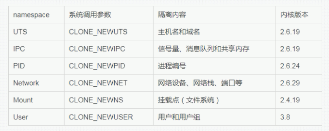

##资源限制
我们试想一种场景，我们现在不在使用主机虚拟化技术，抽取掉主机虚拟化虚拟的内核，所有的空间不在分属于一个独立的内核，而从属于同一个内核，这种技术称为容器级虚拟化技术。

> cpu

在主机虚拟化技术创建虚拟机的时候，是可以进行指定CPU使用多少个核心，多大内存，在创建的时候就可以进行设定好这些资源限制。
在一些场景中，CPU和内存如果直接被使用是会出问题的。CPU属于可压缩资源，而内存就容易出现OOM。所以内核必须实现一种功能来限制每一个用户空间进程所有可用的资源总量。这种分配的方式可以是比例分配，也可以单一用户空间做核心绑定。

- 比例分配：如果是4核心，而三个名称空间分别的是1/4,2/4,1/4,1/4，分别是1，2，1，1核心如果其中不用的资源就会别其他说使用，如果其他也用，就不会超出分配的配额。
- 核心绑定： 绑定多少核心，同时使用不能超过绑定的数量。

> 内存

而内存也是一样的逻辑，可以限制最多使用多少 ，比如使用4G，也就说空间内所有的进程使用的内存总数不能超过4G，如果超过4G，就会OOM掉最耗费内存的进程。因为内存是不可压缩资源。

这些功能必须要在内核依靠cgroups(Control Groups)实现，对于Cgroup来讲，是将系统资源分成多组，将每一个组内的资源量进行指派，分配到特定的用户空间上去。 

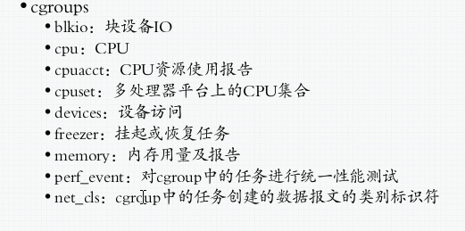

加入将一个用户空间当作一个组，而后向这个组指派不同的资源就可以限制资源。而后将资源给名称空间后，名称空间内部的进程就自动拥有了使用得到分配所有资源的能力。

容器的隔离能力和主机虚拟化相比差了很多，在于同一个内核设置了边界而已。而主机虚拟化本身就不属于同一个内核。为了加强这种安全性，可以通过selinux等机制加强边界。

## lxc

容器技术jail,vserver，后来为了将容器创建的更易用，已工具的方式使用，就出现了lxc(linux Container)，lxc除开vserver，也是最早的真正的将容器技术用简易的工具和模板来极大的简化容器技术使用的方案。所以将自己称为linux Container，简称lxc。

还有一些工具，如：lxc-create，使用这些命令去快速创建一个容器。通常称为一个用户空间。这个用户空间内有一些基础的文件系统和命令程序等，这些可以从宿主机进行复制。但是如果创建的空间运行的系统和宿主机不一样，就不能复制宿主机的文件。

这需要一个template模板，模板其实就是一个脚本，创建了名称空间自动执行脚本后，空间内首先有脚本的执行环境，运行脚本后自动实现安装过程，这个安装就会指向打算创建名称空间内系统发行版所属的仓库，从仓库下载各个程序包，安装，生成一个新的名称空间。这个名称空间就和虚拟机一样被使用。这是一个复杂的过程。

访问到template定义系统发行版的仓库，利用仓库中的程序包下载到本地进行配置安装完成这个过程。

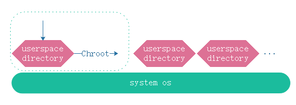

在系统之上应该有根的特权用户空间，在这个子目录上执行一个脚本，可以将一个发行版安装进来，而后chroot。如上图

所有的名称空间都是这么实现。而lxc-create通过这一组工具快速实现了，创建空间，利用template完成内部所需要的文件的安装，同时可完成切换(chroot)。而后就可以使用并行的用户空间，每一个空间和我们所使用的虚拟机几乎一样，有独立系统，主机，ip等等，用户账号等等等，用法和虚拟机一样。 但是仍然有太多的门槛，比如模板定制，理解组件的应用，更重要的是每一个用户空间都是安装生成的，在其中安装一些软件，如redis,mysql，这些应用程序生成的数据迁移到其他机器上，这不太容易。

如果我们想进行规模的批量创建，也是一件难事。尽管lxc极大的简化了一部分容器的使用，相比较比主机虚拟化的复杂程度是没有降低的。而且隔离性也没有虚拟机那么好。好处在与能够让每一个用户空间的进程直接使用宿主机的性能，资源是有一定节约的。对于大批量的使用上，并没有找到很好的突破口，后来就出现了docker。

## docker

而docker则是lxc的增强版。docker也不是容器，只是一个易用的前段工具。容器是linux内核之中的技术，docker只是将技术的使用得以简化和普及。

我们知道lxc需要大量创建容器较为困难，要进行复刻一个一样的容器也很难，docker早期的版本中核心便是lxc，也是lxc的二次封装发行版。

在功能上利用lxc做容器管理引擎，在创建用户空间时候，而不用template直接安装，而是事先通过一种镜像技术。将一个操作系统打包成一个镜像，然后将镜像中的文件复制过去，创建成一个虚拟机，基于这个虚拟机启动即可。类似与这种方式，可以尝试着将一个操作系统用户空间所需要用到的所有组件事先准备编排好，而后整体打包成一个文件，这个文件称为镜像文件--image。

这个镜像文件是放在一个集中统一的位置存放，将做小化的系统放置在仓库内。甚至于nginx，基于某类系统，在系统上装好nginx打包成一个镜像，也放在此仓库中。

想启动创建容器就使用docker进行创建删除等，这使用和lxc一样。但再次之上，docker在create创建一个容器的时候，它不会激活模板安装，而是链接到仓库上，下载一个匹配创建容器的镜像拖到本地，基于镜像启动容器。

docker极大的简化了容器使用难度，在启动一个服务的时候，只需要docker run即可。自动链接到互联网上下载下来运行。大多数的镜像在docker仓库中都有。

为了使得docker更易用和管理，docker还支持另外一种方式，在一个用户空间当中，可以尝试运行一组进程或者一个进程。而docker采用了一种更精巧的机制，在一个容器里面只运行一个进程。

比如：需要运行nginx和php，nginx就运行在nginx容器中，php就运行在php容器中，二者使用容器间通讯进行通讯。

而lxc是将一个容器当作一个用户空间使用，类似与虚拟机一样，里面可以运行多个进程。这样以来在管理的时候就会不便。而docker使用这种限制的方式，在一个容器中只运行一个进程的方式。如下图

但是这样一来，调试就会不方便了，但是对于开发者来讲，使用起来则更方便。并且容器是隔离的，docker在使用的时候是从docker镜像仓库下载镜像的方式。如果要进行批量创建容器，只需要在每台运行容器的机器下载运行一次即可。

- 分层构建联合挂载

镜像构建是分层构建联合挂载的机制实现的。

>  构建一个nginx镜像

基础的alpine纯净的基础镜像，nginx基于alpine构建，而nginx只包含nginx层，底层仍然是alpine。这种方式就是分层构建，一个功能分为一层，迭代一起就形成了统一的视图，组合在一起就成了一个nginx镜像。这样一来就不会显得那么庞大 。

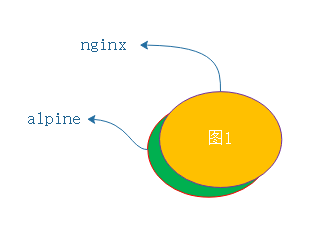

如果要在一个系统上运行三个容器，就需要一个基础镜像(假设为alpine)，在分为三个不同的层，分别是nginx,php,mariadb层，将底层镜像alpine分别与nginx,php,mariadb挂载。而底层的镜像都是共享的，每一层的镜像是只读的。
如果要运行多个nginx，只需要挂在俩次就可以运行两个容器，如下图：

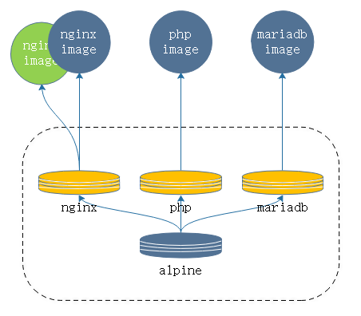

如何进行增删改？

每一层都是只读的。如果要进行修改，就要在每一层的联合挂载镜像顶层额外附加新层，才可以进行读写，如下图

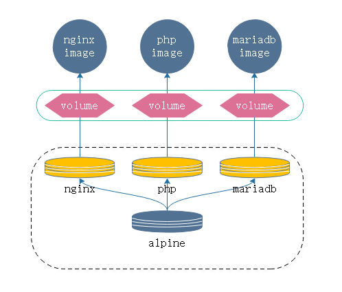

但是如果要删除文件，事实上是无法删除的，这些也是只读的。删除仅仅只是标记为不可见。如果是修改，就进行写时复制，将层复制一层进行修改，查看使用就使用修改过的层，类似与lvm的快照。

尽管这样迁移起来还是会有问题，容器迁移时候，底层是有数据的，在有状态的情况下，一般可以使用共享存储进行存储。这样的话，容器作为一个进程运行，就算容器宕机，删除，数据是不会丢失，宿主机宕机也不会丢失数据。在启动重新挂载就可以在继续使用。如下图

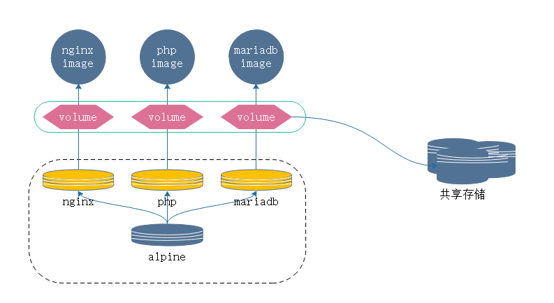

## 容器编排

容器的终止和创建并不会对数据产生影响，容器不需要持久，有了生命周期，像一个进程一样运行，从创建开始从停止结束，并且和主机的关系也不密切，可以运行在任何一个主机之上.

这样一来就可以实现这样的功能。

底层主机-> docker。在docker之上在建立一层，由这一层来决定如何调度，cpu空闲或者内存更多等，根据调度法则决定。可能是在其中任何一台主机启动容器。如果这个容器需要持久数据，就分配一个外部的存储空间挂在，并且存储数据。

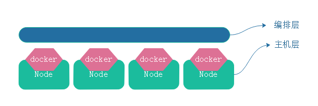

这个组件可以将容器调度与整个底层的系统环境docker环境之上。

倘若要运行一个nmp，docker本身是不能完成顺序启动的，比如：先启动数据库，在启动php，最后启动nginx，但是在docker本身自己是无法完成的。

在docker之上就可以将这种隶属关系，从属关系，启动关系等等反应在启动关闭的次序逻辑中，这种功能就是容器编排。

这些编排工具有dockermachine+swarm,compose,以及kubernetes,还有mesos+marathon组合

但是在后来docker放弃了lxc，研发了自己的引擎libcontainer替换了lxc。而后标准化后的名称叫runC。

参考：https://docs.docker.com/engine/docker-overview/#union-file-systems