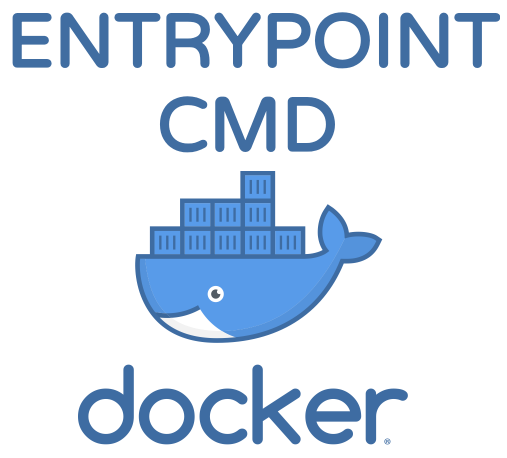

此前的RUN和CMD，我们知道，RUN是构建的时候运行的命令，在镜像完成后RUN就运行结束。随后推送到仓库中，这些RUN命令是不会在进行运行的。



-　init

在Docker上下文中，一个Docker只会运行一个应用程序，那么应该运行那个程序，又是什么应用？

一般情况下，能拥有生产能力的应用通常在宿主机上一般表现是运行在后台守护进程程序，如：mysql,nginx等。

这些服务在运行时候，都是以某个进程运行。某个进程都应该是某个进程的子进程，除init之外，而init是由内核启动的，一般我们在启动一个进程的时候，是以shell的子进程运行的，在命令行下创建的任何进程都是shell的子进程，而有一些经常也会直接占据shell的终端设备，就算使用&放置后台，启动的父进程也仍然是shell。进程终止的时候会将所有的子进程销毁，这种情况下我们会使用nohub command &，这样一来就类似于将启动的进程init

那么在Docker中运行的init进程(init的id是1)是由内核启动，还是托管shell启 动。如果基于内核启动` ls /etc/* `,`|`等shell特性是无法使用的，那么如果基于shell启动，那init的id就不再是1了

- exec

假如想基于shell的方式来启动一个主进程，那么shell的id号就是1，而后基于此在启动主进程，但是这样一来shell就不能退出，那可能需要一种能够剥离终端的方式启动，但是剥离了终端的方式启动，主进程号又不是1了。不过，我们可以使用exec来解决，shell启动是没有问题，进程号id是1也没有关系，exec顶替shell的id为1，取代shell进程，shell退出后exec就成了id为1的进程。

在很多时候，在容器内启动一个应用程序的时候可以不基于shell，直接启动也可以，也可以基于shell，如果基于shell启动，并且不违背shell主进程id为1的调节关系，那么就可以使用第二种方式，exec。

## CMD

RUN是构建的镜象build时候执行的，而cmd是定义一个镜象文件启动为容器时候默认要运行的程序，而Docker容器默认运行一个程序，在运行CMD的时候，是可以写多条CMD的，而最后一条CMD是生效的。而RUN是可以从上倒下接多RUN命令逐一运行。

CMD类属于RUN命令，CMD指令也可以用于运行任何命令或应用程序，不过，二者的运行时间点不同

- RUN指令运行与映像文件构建过程中，而CMD指令运行于基于Dockerfile构建出的新映像文件启动一个容器时
- CMD指令的首要目的在于为启动的容器指定默认要运行的程序，且运行结束后，容器也将终止；不过，CMD指令的命令其可以被Docker run命令选项所覆盖
- 在Dockerfile中可以存在多个CMD指令，但仅最后一个会生效

命令

```
CMD <command>
CMD ["<executable>","<paraml>","<param2>"]
CMD ["<param1>","<param2>"]
```

前两种语法格式的意义同RUN

第一种的CMD的命令执行是直接写命令的，并且PID不为1，也无法接收信号(接收信号的必然是pid为1的超级管理进程)，docker stop也无法停止。

第二种直接启动为ID为1的进程，可接受处理shell信号的。

第三种则用于ENTRYPOINT指令提供默认参数

- 编写Dockerfile

如，创建目录后追加文件，最后用CMD直接调用httpd启动

```bash
FROM busybox
LABEL maintainer="linuxea.com" app="CMD"
ENV WEB_ROOT="/data/wwwroot"

RUN mkdir -p ${WEB_ROOT} \
	&& echo '<h1> helo linuxea .</h1>' >> ${WEB_ROOT}/index.html
CMD /bin/httpd -f -h ${WEB_ROOT}
```

开始build

```bash
[marksugar@linuxEA /data/linuxea2]$ docker build -t marksugar/httpd:9 
Sending build context to Docker daemon  2.048kB
Step 1/5 : FROM busybox
 ---> 59788edf1f3e
Step 2/5 : LABEL maintainer="linuxea.com" app="CMD"
 ---> Running in b6e91f2461dd
Removing intermediate container b6e91f2461dd
 ---> 53559ed7015a
Step 3/5 : ENV WEB_ROOT="/data/wwwroot"
 ---> Running in 3e615febfd44
Removing intermediate container 3e615febfd44
 ---> a7917cb7ecbb
Step 4/5 : RUN mkdir -p ${WEB_ROOT} 	&& echo '<h1> helo linuxea .</h1>' >> ${WEB_ROOT}/index.html
 ---> Running in 15153c929109
Removing intermediate container 15153c929109
 ---> 8e5548f3c00a
Step 5/5 : CMD /bin/httpd -f -h ${WEB_ROOT}
 ---> Running in feeb34a9c423
Removing intermediate container feeb34a9c423
 ---> a091b6d8a31d
Successfully built a091b6d8a31d
Successfully tagged marksugar/httpd:9
```

从这里可以看到，这条启动命令是/bin/sh启动的子进程，在此后启动的时候会替换成id1，也就是默认执行exec将/bin/sh替换掉

```
[marksugar@linuxEA /data/linuxea2]$ docker inspect  marksugar/httpd:9
...			
			"Cmd": [
                "/bin/sh",
                "-c",
                "/bin/httpd -f -h ${WEB_ROOT}"
...                
```

而后run起来，但是这里是没有交互式接口的，尽管使用了-it

```
[marksugar@linuxEA /data/linuxea2]$ docker run --name linuxea --rm  -it marksugar/httpd:9 
```

不过，可以使用exec进入容器，`/bin/httpd -f -h /data/wwwroot`的id为1

- 我们在Dockerfile中直接使用命令的方式避免他不是1，那么这里就直接启动为1，默认执行力exec替换。这也就说明了，尽管使用-it仍然进入不了容器的原因，init1的进程不是shell。进入就要在使用exec绕过进入

```bash
[marksugar@linuxEA ~]$ docker exec -it linuxea sh
/ # ps aux
PID   USER     TIME  COMMAND
    1 root      0:00 /bin/httpd -f -h /data/wwwroot
    7 root      0:00 sh
   13 root      0:00 ps aux
/ # 
```

> 第二种格式

```
CMD ["/bin/httpd","-f","-h ${WEB_ROOT}"]
```

以这种方式进行build

```bash
FROM busybox
LABEL maintainer="linuxea.com" app="CMD"
ENV WEB_ROOT="/data/wwwroot"

RUN mkdir -p ${WEB_ROOT} \
	&& echo '<h1> helo linuxea .</h1>' >> ${WEB_ROOT}/index.html
#CMD /bin/httpd -f -h ${WEB_ROOT}
CMD ["/bin/httpd","-f","-h ${WEB_ROOT}"]
```

启动就会报错No such file

```bash
[marksugar@linuxEA /data/linuxea2]$ docker run --name linuxea --rm  -it marksugar/httpd:10 
httpd: can't change directory to ' ${WEB_ROOT}': No such file or directory
```

报错No such file是因为`CMD ["/bin/httpd","-f","-h ${WEB_ROOT}"]`并不会运行成shell的子进程，而此变量是shell的变量，内核却不知道这个路径，所以会报错。

不过，我们可以指定为shell，如： `CMD ["/bin/sh","-c","/bin/httpd","-f","-h ${WEB_ROOT}"]`

- 引言

此前我们使用一条命令运行容器的时候，CMD的指令是可以被覆盖的，如下

```bash
[marksugar@linuxEA ~]$ docker run --name linuxea --rm  -it marksugar/httpd:9 ls /etc
group        hosts        mtab         passwd       shadow
hostname     localtime    network      resolv.conf
```

上面这条命令是说，运行这个容器，`ls /etc`覆盖了此前镜像中的CMD中的启动httpd的命令。

但是有时候我们不希望被覆盖，就使用ENTRYPOINT

## ENTRYPOINT

类似于CMD指令的功能，用于为容器指定默认的运行程序，从而使得容器像是一个单独的可执行文件

与CMD不同的是由ENTRYPOINT启动的程序不会被docker run命令行指定的参数所覆盖，而且，这些命令行参数会被当作参数传递给ENTRYPOINT指令的指定程序 

不过，docker run命令--entrypoint选项参数可覆盖ENTRYPOINT指令指定的程序

```bash
ENTRYPOINT  <command>
ENTRYPOINT  ["<executable>","<param1>","<param2>"]
```

docker run命令传入的命令参数会覆盖CMD指令的内容并且附加到ENTRYPOINT命令最后作为其参数使用

Dockerfile文件中也可以存在多个ENTRYPOINT指令，但仅有最后一个生效

我们先编写一个Dockerfile，使用NETRYPOINT启动

```
FROM busybox
LABEL maintainer="linuxea.com" app="CMD"
ENV WEB_ROOT="/data/wwwroot"

RUN mkdir -p ${WEB_ROOT} \
	&& echo '<h1> helo linuxea .</h1>' >> ${WEB_ROOT}/index.html
ENTRYPOINT /bin/httpd -f -h ${WEB_ROOT}
```

而后build

```bash
[marksugar@linuxEA /data/linuxea2]$ docker build -t marksugar/httpd:11 .
Sending build context to Docker daemon  2.048kB
Step 1/5 : FROM busybox
 ---> 59788edf1f3e
Step 2/5 : LABEL maintainer="linuxea.com" app="CMD"
 ---> Using cache
 ---> 53559ed7015a
Step 3/5 : ENV WEB_ROOT="/data/wwwroot"
 ---> Using cache
 ---> a7917cb7ecbb
Step 4/5 : RUN mkdir -p ${WEB_ROOT} 	&& echo '<h1> helo linuxea .</h1>' >> ${WEB_ROOT}/index.html
 ---> Using cache
 ---> 8e5548f3c00a
Step 5/5 : ENTRYPOINT /bin/httpd -f -h ${WEB_ROOT}
 ---> Running in 34c028efac0d
Removing intermediate container 34c028efac0d
 ---> b7be6f74fc65
Successfully built b7be6f74fc65
Successfully tagged marksugar/httpd:11
```

启动是没有问题的

```bash
[marksugar@linuxEA /data/linuxea2]$ docker run --name linuxea --rm  -it marksugar/httpd:11
```

我们获取到这个ip。访问试试

```
[marksugar@linuxEA ~]$ docker inspect -f {{.NetworkSettings.IPAddress}} linuxea
192.168.100.2
```

```
[marksugar@linuxEA ~]$ curl 192.168.100.2
<h1> helo linuxea .</h1>
```

- ENTRYPOINT

而后使用CMD的方式同样来覆盖

```
[marksugar@linuxEA /data/linuxea2]$ docker run --name linuxea --rm  -it marksugar/httpd:11 ls /etc
```

容器依然运行起来，但我们并没有看到`ls /etc`的内容。这是因为在run的时候使用了`ls /etc`并不会替换Dockerfile中ENTRYPOINT的运行命令，只是在ENTRYPOINT命令之后加了`ls /etc`，而httpd识别不出`ls /etc`而已 

如果一定要进行覆盖，就需要使用`--entrypoint`，如下：

`docker run --name linuxea --rm  -it --entrypoint "/bin/ls" marksugar/httpd:11 -al /etc`

```
[marksugar@linuxEA ~]$ docker run --name linuxea --rm  -it --entrypoint "/bin/ls" marksugar/httpd:11 -al /etc
total 28
drwxr-xr-x    1 root     root            66 Dec  8 09:07 .
drwxr-xr-x    1 root     root             6 Dec  8 09:07 ..
-rw-rw-r--    1 root     root           307 Sep  6 20:11 group
-rw-r--r--    1 root     root            13 Dec  8 09:07 hostname
-rw-r--r--    1 root     root           177 Dec  8 09:07 hosts
-rw-r--r--    1 root     root           127 May  4  2018 localtime
lrwxrwxrwx    1 root     root            12 Dec  8 09:07 mtab -> /proc/mounts
drwxr-xr-x    6 root     root            79 Oct  1 22:37 network
-rw-r--r--    1 root     root           340 Sep  6 20:11 passwd
-rw-r--r--    1 root     root           114 Dec  8 09:07 resolv.conf
-rw-------    1 root     root           243 Sep  6 20:11 shadow
```

## 示例

### ENTRYPOINT

此时我们知道ENTRYPOINT是作为入口点的指令，通过exec 指定，指定的命令和参数作为一个JSON数组，那就意味着需要使用双引号而不是单引号

```
ENTRYPOINT ["executable", "param1", "param2"]
```

使用此语法，Docker将不使用命令shell，这意味着不会发生正常的shell处理。如果需要shell处理功能，则可以使用shell命令启动JSON数组。

```
ENTRYPOINT [ "sh", "-c", "echo $HOME" ]
```

另一种选择是使用脚本来运行容器的入口点命令。按照惯例，它通常在名称中包含**入口点**。在此脚本中，您可以设置应用程序以及加载任何配置和环境变量。下面是一个如何使用`ENTRYPOINT` **exec**语法在Dockerfile中运行它的示例。

```
COPY ./docker-entrypoint.sh /
ENTRYPOINT ["/docker-entrypoint.sh"]
CMD ["postgres"]
```

例如，[Postgres官方图像](https://hub.docker.com/_/postgres/)使用以下脚本作为其`ENTRYPOINT`：

```
#!/bin/bash
set -e
if [ "$1" = 'postgres' ]; then
    chown -R postgres "$PGDATA"
    if [ -z "$(ls -A "$PGDATA")" ]; then
        gosu postgres initdb
    fi
    exec gosu postgres "$@"
fi
exec "$@"
```

- docker-compose 的写法：

Docker Compose文件中使用的命令是相同的，除了使用小写字母。

```
entrypoint: /code/entrypoint.sh
```

可以在docker-compose.yml中使用列表定义入口点。

```
entrypoint:
    - php
    - -d
    - zend_extension=/usr/local/lib/php/xdebug.so
    - -d
    - memory_limit=-1
    - vendor/bin/phpunit
```

不过仍然可可以使用`docker run --entrypoint`或`docker-compose run --entrypoint`标记覆盖入口的指令

### CMD/command

`CMD`（Dockerfiles）/ `command`（Docker Compose文件）的主要目的是在执行容器时提供默认值。这些将在入口点之后被附加到入口的参数。

例如，如果运行`docker run <image>`，则将执行Dockerfiles中`CMD`/所指定的命令和参数`command`。

在Dockerfiles中，可以定义`CMD`包含可执行文件的默认值。例如：

```
CMD ["executable","param1","param2"]
```

如果省略了可执行文件，则还必须指定一条`ENTRYPOINT`指令。

`CMD ["param1","param2"]` （作为ENTRYPOINT的默认参数）

**注意**：其中只能有一条`CMD`指令`Dockerfile`。如果列出多个`CMD`，则只有最后一个`CMD`生效。

#### Docker Compose命令

使用Docker Compose时，可以在docker-compose.yml中定义相同的指令，但它以小写形式写成完整的单词`command`。

```
command: ["bundle", "exec", "thin", "-p", "3000"]
```

#### 覆盖CMD

可以覆盖`CMD`运行容器时指定的命令。

```
docker run rails_app rails console
```

如果指定了参数`docker run`，那么它们将覆盖指定的默认值`CMD`。

#### 语法最佳实践

还有EXEC语法，shell语法两个另一个有效的选项`ENTRYPOINT`和`CMD`。这将以字符串形式执行此命令并执行变量替换。

```
ENTRYPOINT command param1 param2
CMD command param1 param2
```

>*CMD*`应该几乎总是以形式使用`*CMD [“executable”, “param1”, “param2”…]*`。因此，如果镜象是用于服务的，例如Apache和Rails，那么你可以运行类似的东西`*CMD ["apache2","-DFOREGROUND"]*`。实际上，建议将这种形式的指令用于任何基于服务的镜象。

>所述`*ENTRYPOINT*`shell形式防止任何`*CMD*`或`*run*`被使用命令行参数覆盖，但是有缺点，`*ENTRYPOINT*`将被开始作为一个子命令`*/bin/sh -c*`，其不通过信号。这意味着可执行文件将不是容器`*PID 1*`- 并且不会收到Unix信号 - 因此您的可执行文件将不会收到`*SIGTERM*`来自`*docker stop <container>*`
>
>如果`*CMD*`用于为`*ENTRYPOINT*`指令提供默认参数，则应使用JSON数组格式指定`*CMD*`和`*ENTRYPOINT*`指令。

#### Both 

`CMD`和`ENTRYPOINT`instructions指定运行容器时执行的命令。很少有规则描述它们如何相互作用。

1. Dockerfiles应至少指定一个`CMD`或`ENTRYPOINT`命令。
2. `ENTRYPOINT` 应该在将容器用作可执行文件时定义。
3. `CMD`应该用作定义`ENTRYPOINT`命令的默认参数或在容器中执行ad-hoc命令的方法。
4. `CMD` 在使用替代参数运行容器时将被覆盖。