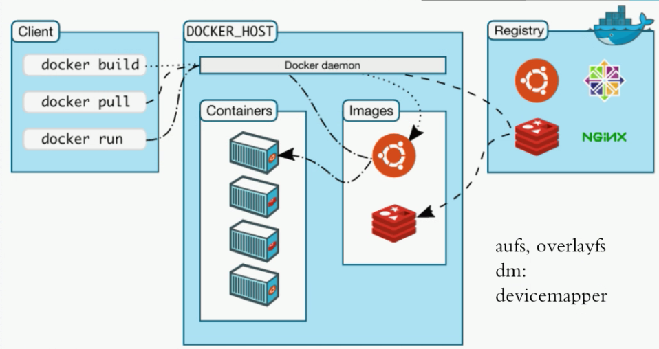
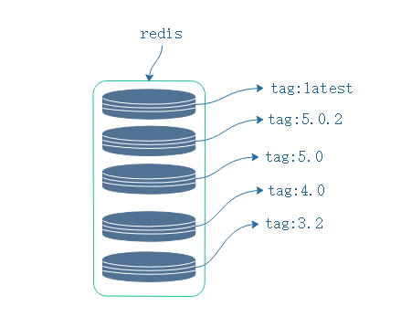
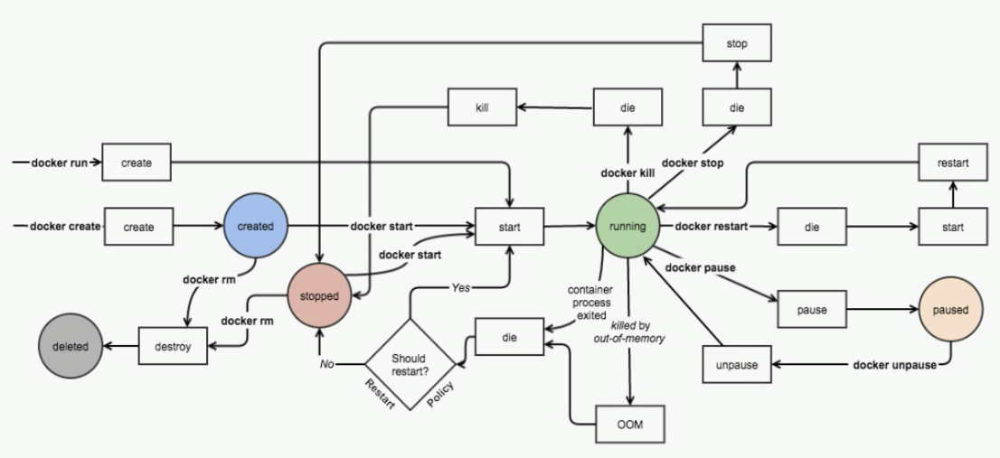

我们知道，要想使用容器就需要在内核支持namespace，cgroups，借助于在用户空间组织一些工具利用内核所提供的技术，显示运行容器的目的。docker在容器运行简化上又近一步的，提供了镜像，分层构建，使得容器技术的使用更加被简化。后来在docker的主导下，演化出ocf(open container initiative)标准：皆在围绕容器格式和运行时制定一个开放的工业化标准。而runC是在新版本中使用的容器引擎。而[dockerhub](www.dockerhub.com)是容纳容器镜像的站点。 整个docker架构如下组成：



客户端：

server端：Dockerhost，也就是server端，也是一个c/s架构的应用程序，也就是说server和client都是由一个程序提供。有很多子程序，其中有一个子程序子命令叫做daemon，表示运行为守护进程服务器，监听某个套接字之上。为了安全期间，这个套接字默认只提供了unix socket文件套接字。但是支持三种 模式的套接字： ipvs4,ipv6,unix socketfile，默认监听在本地的socketfile文件之上，另外两个是没有监听的。也就是只允许本地范围。

## containers images

镜像来自Registry，也就是docker的镜像仓库，默认是dockerhub。镜像是分层构建的，这些仓库中的镜像下载到本地后，是可以进行共享多个上层镜像使用的。镜像也是只读的，所以启动容器时候是基于镜像来启动， 为一个容器创建一个专用的可写仓，从而来启动一个容器。

镜像也可以在本地存储。但是docker的镜像千千万，使用时候只需要在仓库拉取到本地，这里的协议是http/https，默认是https

docker的client的应用层协议也是https。要使用docker就需要将docker应用程序包下载即可。

那么docker在第一次运行一个镜像的时候，会在本地查找，如果没有就会去仓库下载。

- 镜像与容器之间的关系

镜像是静态的，类似于程序文件。容器是动态的，有生命周期。

当使用镜像(在被下载后)启动一个容器，这个容器被关闭，容器就终止，而镜像文件始终存在。这种关系就是程序和进程的关系
```
		|--> 容器1
--镜像|
		|--> 容器2
		|--> 容器...		
```
## Registry

一个docker Registry提供两层功能，第一，提供了镜像存储的仓库，第二，提供了用户获取镜像时的认证等功能。同时还提供了当前服务器上所有镜像的搜索索引。

在一个Registry上，仓库会有很多。一个docker镜像仓库，有仓库的名称--> repository，repo，一个仓库通常用来放一个应用程序的镜像，仓库名就是应用程序名，通过tag来表示每个镜像的构建版本，以redis为例， 如下：



那组合起来的名称就是仓库加标签的形式，如:redis:5.0.2，如果没有指定tag，就会使用latest--> redis:latest，latest默认 为最近提交的一个没有指定版本的镜像。当然，还有稳定版redis:stable。

还有其他的基础镜像，也是有标签的。

docker是restfull风格的接口，在docker上每个组件都被当作资源或者对象来管理。支持restfull，那也就意味着支持增删改查。这些对象有：images，containers，networks网络，volumes存储卷，plugins插件。这些对象就可以通过http进行get,pet,delete

## 安装docker

先决条件：

```
	64bits CPU
	linux Kernet 3.10+ (centos7以上完美支持)
```

我们使用清华大学的mirros仓库`https://mirrors.tuna.tsinghua.edu.cn/docker-ce/linux/centos/`

```
curl -Lks https://mirrors.tuna.tsinghua.edu.cn/docker-ce/linux/centos/docker-ce.repo -o  /etc/yum.repos.d/docker-ce.repo 
```

顺便修改下安装路径

```
[marksugar@www.linuxea.com ~]$ sed -i 's@https://download.docker.com/@https://mirrors.tuna.tsinghua.edu.cn/docker-ce/@g' /etc/yum.repos.d/docker-ce.repo
```

```
[marksugar@www.linuxea.com ~]$ yum repolist
已加载插件：fastestmirror
Determining fastest mirrors
 * elrepo: ftp.yz.yamagata-u.ac.jp
源标识                               源名称                                                  状态
!base/7/x86_64                       CentOS-7 - Base                                         9,901+10
!docker-ce-stable/x86_64             Docker CE Stable - x86_64                                     25
!elrepo                              ELRepo.org Community Enterprise Linux Repository - el7       246
!epel/x86_64                         Extra Packages for Enterprise Linux 7 - x86_64            12,703
!extras/7/x86_64                     CentOS-7 - Extras                                            434
!kubernetes                          Kubernetes                                                 7+265
!updates/7/x86_64                    CentOS-7 - Updates                                      1,543+71
repolist: 24,859
```

```
[marksugar@www.linuxea.com ~]$  yum install docker-ce -y
```

配置文件在`/etc/docker/daemon.json`，这个文件和目录在第一次启动之前都不存在。为了使得镜像下载速度快些，我们定义一个镜像加速器。如：阿里云加速器，或者docker cn

参考：https://www.docker-cn.com/registry-mirror

可以在 Docker 守护进程启动时传入 `--registry-mirror` 参数：

```
[marksugar@www.linuxea.com ~]$ docker --registry-mirror=https://registry.docker-cn.com daemon
```

为了永久性保留更改，您可以修改 `/etc/docker/daemon.json` 文件并添加上 registry-mirrors 键值。

```
[marksugar@www.linuxea.com ~]$ mkdir -p /etc/docker/
```

```
[marksugar@www.linuxea.com ~]$ cat > /etc/docker/daemon.json << EOF
{
  "registry-mirrors": ["https://registry.docker-cn.com"]
}
EOF
```

修改保存后重启 Docker 以使配置生效。

```
[marksugar@www.linuxea.com ~]$ systemctl restart docker
```

docker 命令中包含了老版本的命令，如`docker create`和`docker container create`

```
[marksugar@www.linuxea.com ~]$ docker version
Client:
 Version:      18.05.0-ce
 API version:  1.37
 Go version:   go1.9.5
 Git commit:   f150324
 Built:        Wed May  9 22:14:54 2018
 OS/Arch:      linux/amd64
 Experimental: false
 Orchestrator: swarm

Server:
 Engine:
  Version:      18.05.0-ce
  API version:  1.37 (minimum version 1.12)
  Go version:   go1.9.5
  Git commit:   f150324
  Built:        Wed May  9 22:18:36 2018
  OS/Arch:      linux/amd64
  Experimental: false
```

也可以使用docker info查看详细信息

```
[marksugar@www.linuxea.com ~]$ docker info
Containers: 4
 Running: 4
 Paused: 0
 Stopped: 0
Images: 36
Server Version: 18.05.0-ce
Storage Driver: overlay2
 Backing Filesystem: xfs
 Supports d_type: true
 Native Overlay Diff: true
Logging Driver: json-file
Cgroup Driver: cgroupfs
Plugins:
 Volume: local
 Network: bridge host macvlan null overlay
 Log: awslogs fluentd gcplogs gelf journald json-file logentries splunk syslog
Swarm: inactive
Runtimes: runc
Default Runtime: runc
Init Binary: docker-init
containerd version: 773c489c9c1b21a6d78b5c538cd395416ec50f88
runc version: 4fc53a81fb7c994640722ac585fa9ca548971871
init version: 949e6fa
Security Options:
 seccomp
  Profile: default
Kernel Version: 4.16.13-1.el7.elrepo.x86_64
Operating System: CentOS Linux 7 (Core)
OSType: linux
Architecture: x86_64
CPUs: 4
Total Memory: 3.848GiB
Name: www.linuxea.com.dwhd.org
ID: UV5V:AOKT:SXO7:URPV:WNSI:76DP:X76H:FYWU:VWQH:BGSU:5TMP:274A
Docker Root Dir: /var/lib/docker
Debug Mode (client): false
Debug Mode (server): false
Username: marksugar
Registry: https://index.docker.io/v1/
Labels:
Experimental: false
Insecure Registries:
 127.0.0.0/8
Registry Mirrors:
 https://registry.docker-cn.com/
Live Restore Enabled: false
```

> docker的镜像是分层构建联合挂载，而分层构建和联合挂载必须要求使用特殊的文件系统才能实现，xfs和exet是不支持的，必须使用特殊的格式才行，这里使用的是overlay2

这里是加速的地址，这样的话，说明加速成功，如下：

```
Registry Mirrors:
 https://registry.docker-cn.com/
```

## docker命令

docker的命令可以使用docker --help查看，简单介绍几个常用的命令

```
docker search  查找，搜索镜像
docker pull  docker拉取镜像
docker images  查看本地镜像
docker create  创建容器
docker start 启动容器
docker run  创建一个容器直接启用
docker ps  列出容器，-a 列出所有
docker logs   查看容器日志
docker restart 重启容器
docker stop 停止容器
docker kill 杀掉容器
docker rm   删除容器
docker rmi  删除镜像
docker top 本机监控容器
```

那我们在使用docker search时候，没有/分割的就是顶级仓库，有/的就是用户仓库，而没有/的就是官方的仓库，如下：

```
[marksugar@www.linuxea.com ~]$ docker search redis
NAME             DESCRIPTION                                     STARS OFFICIAL  AUTOMATED
redis            Redis is an open source key-value store that…   6130  [OK]      
bitnami/redis    Bitnami Redis Docker Image                      97              [OK]
sameersbn/redis                                                  74              [OK]
```

这些镜像同时也可以在[dockerhub](www.dockerhub.com)上进行查看详情页面和tag版本。

- docker images

我们可以通过docker images查看镜像到本地的状态，使用`docker images --no-trunc`查看详细的id等

```
[marksugar@www.linuxea.com ~]$ docker images
REPOSITORY         TAG                 IMAGE ID            CREATED             SIZE
仓库名称			标签				   镜像ID				  启动运行时间		  镜像大小
jdk_java8          latest              a875c82fc83c        9 days ago          228MB
marksugar/java     jdk1.8.0_131        a875c82fc83c        9 days ago          228MB
jdk8               latest              89af3e576f52        10 days ago         174MB
marksugar/alpine   jdk8                89af3e576f52        10 days ago         174MB
```

- docker ps

```
[marksugar@www.linuxea.com ~]$ docker ps -a
CONTAINER ID   IMAGE                 COMMAND           CREATED   STATUS   PORTS NAMES
容器运行ID	   基于什么镜像启动的容器   容器中运行的命令和脚本  创建时间   当前状态    映射端口 名称
c2563e96a47a  marksugar/mariadb:10.2.15 "/start.sh"  10 days ago  Up 39 minutes mariadb
```

此刻有了镜像，就可以运行一个容器试试

- docker run

```
[marksugar@www.linuxea.com ~]$ docker run --help
Usage:	docker run [OPTIONS] IMAGE [COMMAND] [ARG...]
```

这里需要参数是

```
-i, --interactive 
-t, --tty    
--name 名称
--network 网络模式
--rm  如果容器停止就自动删除
-d 运行在后台
```

我们run一个

如果这个busybox:latest本地就就会使用本地的，如果没有就在dockerhub上拉取

```
[marksugar@www.linuxea.com ~]$ docker run --name 5idocker -it busybox:latest
Unable to find image 'busybox:latest' locally
latest: Pulling from library/busybox
90e01955edcd: Pull complete 
Digest: sha256:2a03a6059f21e150ae84b0973863609494aad70f0a80eaeb64bddd8d92465812
Status: Downloaded newer image for busybox:latest
/ # ls
bin   dev   etc   home  proc  root  sys   tmp   usr   var
```

sh是运行的pid为1，如果pid 1被关闭就会退出镜像

```
/ # top
Mem: 3726980K used, 307616K free, 213648K shrd, 76K buff, 2958016K cached
CPU:  0.0% usr  0.0% sys  0.0% nic  100% idle  0.0% io  0.0% irq  0.0% sirq
Load average: 0.00 0.02 0.00 2/301 11
  PID  PPID USER     STAT   VSZ %VSZ CPU %CPU COMMAND
    1     0 root     S     1260  0.0   1  0.0 sh
   10     1 root     R     1248  0.0   3  0.0 top
/ # 
```

这里有现成的httpd，我们创建一个文件测试下

```
/ # mkdir /data/5idocker -p
/ # cat > /data/5idocker/index.html << EOF
> helo 5idocker
> EOF
/ # httpd -f -h /data/5idocker/
```

回到宿主机，查看下` docker inspect 5idocker`

```
[marksugar@www.linuxea.com ~]$ docker inspect 5idocker|tail -20
            "Networks": {
                "bridge": {
                    "IPAMConfig": null,
                    "Links": null,
                    "Aliases": null,
                    "NetworkID": "aeb93fd1bb6abcc31fb3f34c055d8a24eb8e9b30ede398623848f514f8299d04",
                    "EndpointID": "38df7e3d64b53df2f867c6446fc72f3782907229599d5c3219c0e548022190c3",
                    "Gateway": "172.17.0.1",
                    "IPAddress": "172.17.0.2",
                    "IPPrefixLen": 16,
                    "IPv6Gateway": "",
                    "GlobalIPv6Address": "",
                    "GlobalIPv6PrefixLen": 0,
                    "MacAddress": "02:42:ac:11:00:02",
                    "DriverOpts": null
                }
            }
        }
    }
]
```

通过容器的ip访问

```
[marksugar@www.linuxea.com ~]$ curl 172.17.0.2
helo 5idocker
```

这相当于两个虚拟空间之间通讯

当退出后，容器停止运行

```
[marksugar@www.linuxea.com ~]$ docker ps -a
CONTAINER ID  IMAGE    COMMAND     CREATED       STATUS     PORTS               NAMES
0540f70524a6  busybox:latest "sh" 26 minutes ago  Exited (130) 37 seconds ago  5idocker
```

如果要在进如容器，就需要docker start 5idocker 激活

```
[marksugar@www.linuxea.com ~]$ docker start 5idocker 
5idocker
[marksugar@www.linuxea.com ~]$ docker ps -a
CONTAINER ID    IMAGE      COMMAND  CREATED    STATUS    PORTS               NAMES
0540f70524a6   busybox:latest  "sh"  27 minutes ago    Up 2 seconds   5idocker
```

如果容器内运行的是守护进程，直接启动即可。如果是sh就可以使用-it 跟 bash进入

```
[marksugar@www.linuxea.com ~]$ docker exec -it 5idocker sh
/ # 
```

也可以使用`docker start -i -a 5idocker`

```
[marksugar@www.linuxea.com ~]$ docker start -i -a 5idocker
/ # 
```

那么也可以使用kill杀掉

```
[marksugar@www.linuxea.com ~]$ docker kill 5idocker 
5idocker
```

而后就可以删除

```
[marksugar@www.linuxea.com ~]$ docker rm 5idocker 
5idocker
```

> 如果是运行状态，就需要使用`docker rm -f 5idocker`来删除镜像


- 创建nginx容器

下载一个镜像nginx镜像，并run起来

```
[marksugar@www.linuxea.com ~]$ docker run --name 5idocker-nginx nginx:1.14-alpine
Unable to find image 'nginx:1.14-alpine' locally
1.14-alpine: Pulling from library/nginx
4fe2ade4980c: Already exists 
c691664ebb08: Pull complete 
a6f6a50701b6: Pull complete 
5980ba3b5a39: Pull complete 
Digest: sha256:75cf17cdf89cbd8da65c83050ebdab1026b98cf217442d6a1f2a8892f47967d7
Status: Downloaded newer image for nginx:1.14-alpine
```

我们知道，一个容器就运行一个程序，一个程序如果运行在后台，就会被容器认为已经终止了。容器中任何程序都需要运行在前台，如果运行在后台，一启动就会被终止。所以我们这里看到的是"nginx -g 'daemon off'"

```
[marksugar@www.linuxea.com ~]$ docker ps -a
CONTAINER ID   IMAGE   COMMAND  CREATED   STATUS     PORTS       NAMES
22e6403dae98  nginx:1.14-alpine  "nginx -g 'daemon of…" 23 seconds ago Up 22 seconds  80/tcp 5idocker-ngin
```

前台进程作为支持容器的骨架，是不能没有的，如果运行在后台容器就无法启动。

对于5idocker-ngin来将用的地址可以像上面那样获取

```
[marksugar@www.linuxea.com ~]$  docker inspect 5idocker-nginx |tail -20
            "Networks": {
                "bridge": {
                    "IPAMConfig": null,
                    "Links": null,
                    "Aliases": null,
                    "NetworkID": "aeb93fd1bb6abcc31fb3f34c055d8a24eb8e9b30ede398623848f514f8299d04",
                    "EndpointID": "fafa3e0b02165e7e6ae40a1144b88ccbaab583bbd4ac7384df63483aabaf35e2",
                    "Gateway": "172.17.0.1",
                    "IPAddress": "172.17.0.2",
                    "IPPrefixLen": 16,
                    "IPv6Gateway": "",
                    "GlobalIPv6Address": "",
                    "GlobalIPv6PrefixLen": 0,
                    "MacAddress": "02:42:ac:11:00:02",
                    "DriverOpts": null
                }
            }
        }
    }
]
```

而后可以使用exec绕过容器的边界到容器内访问

```
[marksugar@www.linuxea.com ~]$ docker exec -it 5idocker-nginx sh
```

而后访问下本地

```
/ # curl 127.0.0.1
<!DOCTYPE html>
<html>
<head>
<title>Welcome to nginx!</title>
<style>
    body {
        width: 35em;
        margin: 0 auto;
        font-family: Tahoma, Verdana, Arial, sans-serif;
    }
</style>
</head>
<body>
<h1>Welcome to nginx!</h1>
<p>If you see this page, the nginx web server is successfully installed and
working. Further configuration is required.</p>

<p>For online documentation and support please refer to
<a href="http://nginx.org/">nginx.org</a>.<br/>
Commercial support is available at
<a href="http://nginx.com/">nginx.com</a>.</p>

<p><em>Thank you for using nginx.</em></p>
</body>
</html>
```

也可以直接使用docker logs  5idocker-nginx查看容器内的日志

```
[marksugar@www.linuxea.com ~]$ docker logs  5idocker-nginx 
172.17.0.2 - - [24/Nov/2018:14:01:01 +0000] "GET / HTTP/1.1" 200 612 "-" "curl/7.61.1" "-"
127.0.0.1 - - [25/Nov/2018:04:26:53 +0000] "GET / HTTP/1.1" 200 612 "-" "curl/7.61.1" "-"
```

常用命令示意图



