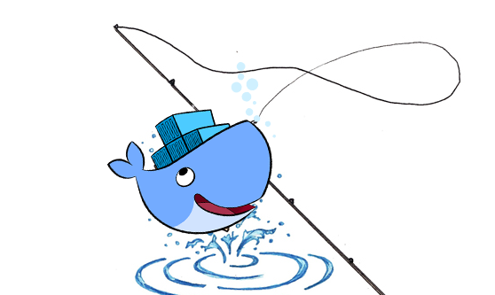

docker命令如何过滤docker容器，image，volumes

[Docker命令](https://docs.docker.com/engine/reference/commandline/cli/)可以与[过滤器](https://docs.docker.com/engine/reference/commandline/ps/#show-both-running-and-stopped-containers)以及其他bash命令结合使用，包括`grep`和`awk`搜索和查找特定类型的容器，image和volumes。

这些组合的一个重要用途是将搜索到的项的ID传递给另一个Docker命令以在所有这些项上执行。

第一个示例查找具有该`nginx_repo`images的容器的所有ID，第二个示例查找在特定时间创建的容器的ID。然后`docker rm`将它们传递给上一个命令以将它们全部删除。

删除nginx_repo容器

```
[root@linuxea ~]$ docker rm $(docker ps -a|awk '/nginx_repo/{print $1}')
```

或者按照时间来删除

```
[root@linuxea ~]$ docker rm $(docker ps -a|awk '/2 months ago/{print $1}')
```

## 过滤Filters

过滤器允许你搜索特定类型的Docker容器，image和volumes。

> 过滤标志（-f或--filter）格式为“key = value”。如果有多个过滤器，则传递多个标志（例如--filter "foo=bar" --filter "bif=baz"）
>
>  - [ Docker Docs：ps过滤](https://docs.docker.com/engine/reference/commandline/ps/#filtering)

```
docker images --filter "dangling=true"
```

一些常用过滤器包括：

- `dangling`（boolean - true或false，0或1），[Dangling(翻译过来"悬空")一词意味着未使用](https://docs.docker.com/config/pruning/) 

>  Dangling 意味着未使用的images表示尚未在容器中分配或使用它。例如，在运行时`docker ps -a`- 它将列出所有已退出和当前正在运行的容器。在任何容器内使用的任何images都是“使用过的images”。
>
>  另一方面，Dangling images只是意味着你已经创建了images的新构建，但没有给出新名称。所以你所拥有的旧images就变成了“悬空images”。那些旧images是未标记的images，并`<none>`在运行时在其名称上显示“ ” `docker images`。
>
>  在此前的文章中介绍过如何进行[清理docker镜像和容器和卷](https://www.linuxea.com/2246.html)，事实上，运行`docker system prune -a`，它将删除未使用和悬空的images。因此，容器中使用的任何images，无论是已退出还是当前正在运行，都不会受到影响
>
>  另外，Dockerimages由多个图层组成。Dangling images是与任何标记images无关的图层。它们不再用于目的并占用磁盘空间。
>
>  - 列出
>
>  `docker images -f dangling = true`
>
>  - 删除
>
>  `docker rmi $（docker images -f dangling = true -q）`

- `label`（`label=<key>`或`label=<key>=<value>`），[用于将额外的元数据应用于Docker对象](https://docs.docker.com/config/labels-custom-metadata/)
- `name` （容器或卷的名称）

例如，要过滤Docker容器并选择名称中包含字符串“mariadb”的容器：

```
[root@linuxea ~]$ docker ps --filter "name=mariadb"
CONTAINER ID        IMAGE                       COMMAND             CREATED             STATUS              PORTS               NAMES
c2563e96a47a        marksugar/mariadb:10.2.15   "/start.sh"         2 months ago        Up 6 weeks                              mariadb
```

该[docker文档](https://docs.docker.com/engine/reference/commandline/cli/)具有过滤的例子，比如一个完整列表[docker PS页](https://docs.docker.com/engine/reference/commandline/ps/#filtering)。

## grep

该[docker CLI命令](https://docs.docker.com/engine/reference/commandline/cli/)集成了[bash](https://www.gnu.org/software/bash/)命令，所以你可以使用的方法，如`grep`通过docker的数据进行搜索。

> **grep**在输入文件中搜索包含与给定模式列表匹配的行。当它在一行中找到匹配时，它会将该行复制到标准输出（默认情况下），或者你通过选项请求的任何其他类型的输出。
>
>  - [**TLDP Bash初学者指南：使用grep的示例**](http://tldp.org/LDP/Bash-Beginners-Guide/html/sect_04_02.html)[ ](http://tldp.org/LDP/Bash-Beginners-Guide/html/sect_04_02.html)

让我们更详细地看一下本文开头的例子。

```
示例：删除所有包含关键字mariadb的容器
docker rm $(docker ps -a | awk '/mariadb/{print $1}')
```

- `docker rm` - 按ID删除容器
- `$()` - 返回在括号内运行脚本的结果
- `docker ps -a` - 列出所有容器的docker
- `| grep mariadb` -  [管道](http://www.linfo.org/pipes.html)上一个命令的结果，`grep`以搜索包含字符串“mariadb”的行
- `| awk '{print $1}'` -  [管道](http://www.linfo.org/pipes.html)的结果`grep`搜索到的`awk`命令，该命令被告知仅打印在第1列，其是容器的ID的值

> 注意：我们可以有更好的方法，特别是在脚本中执行的时候，如果没有找到容器，则可以避免引发错误：
> mac：`docker ps -a |  awk '/mariadb/{print $1}' | xargs docker rm`
> gnu linux＆unix：`docker ps -a |  awk '/mariadb/{print $1}'| xargs --no-run-if-empty docker rm`

## 学习更多

学习如何使用Docker CLI命令，Dockerfile命令，使用Bash命令可以帮助你更有效地使用Docker应用程序。查看Docker文档和我的其他帖子以了解更多信息。

- [docker目录](https://www.linuxea.com/category/big-data/)
- [白话容器](https://www.linuxea.com/tag/%E7%99%BD%E8%AF%9D%E5%AE%B9%E5%99%A8/)
