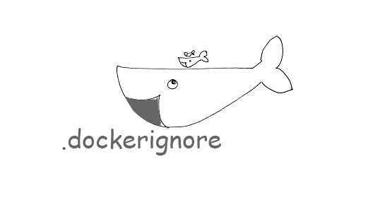

`.dockerignore`的文章或许对老司机来说是一个过时的话题，但是我已经写了很多关于dockers使用的文章，并且我在讨论群组里面发现有人对此`.dockerignore`并不清楚，在这种情况下，我有必要重新复述一次。查看本章节，你将了解`.dockerignore`的使用和注意事项。祝你愉快

Docker镜像可以和普通应用一样运行在云服务上，为什么还要优化它们呢？事实证明使用.dockerignore有很多好处。它可以帮助减少Docker镜像大小，加速`docker build`并避免意外的秘密曝光（请继续阅读以了解我的意思）。要理解.dockerignore为何如此有效，你必须了解构建上下文。 

# Docker build context

该[`docker build`](https://docs.docker.com/engine/reference/builder/)命令用于构建新的Docker镜像。你可以将一个参数传递给`build`命令**构建上下文（build context）**。此后的叙述中，都称为“构建上下文”

## 什么是build context？

首先，Docker是一个客户端 - 服务器应用程序，它由Docker客户端和Docker服务器（也称为Docker  *守护程序*）组成。Docker客户端命令行工具与Docker服务器通信并要求它执行操作。其中一个是Docker  **build**：构建一个新的Docker镜像。Docker可以在与客户端，远程计算机或虚拟机上运行，也可以是本地，远程甚至在某些云IaaS上运行。

## 有哪些是重要的？

为了创建一个新的Docker镜像，Docker服务器需要访问文件并从中创建Docker镜像。因此，你需要以某种方式将这些文件发送到Docker服务器。这些文件是Docker **构建**不可缺少的部分。Docker客户端将所有**构建上下文**文件打包到`tar`存档中，并将此存档上传到Docker服务器。默认情况下，客户端将获取当前工作目录中的所有文件（和文件夹），并将它们用作**构建上下文**。
它还可以接受已创建的`tar`存档或`git`存储库。在`git`存储库的情况下 ，客户端将克隆到临时文件夹中，并从中创建**构建上下文**存档。

# 对Docker构建的影响

你看到，运行该`docker build`命令的第一个输出行是：

```
Sending build context to Docker daemon  4.608kB
Step 1/5 : FROM alpine:3.9
```

这应该让事情变得清晰。实际上，**每次**运行`docker build`命令时，Docker客户端都会创建一个新的**构建上下文**存档并将其发送到Docker服务器。因此，总是这样：创建存档，存储和网络流量以及延迟时间所需的时间。

> **提示**：如果你在Docker镜像中不需要它们，则不将文件添加到构建上下文中。

# **dockerignore**文件

该`.dockerignore`文件是隐藏文件也是一个工具，可以帮助你定义你真正需要的Docker **构建上下文**。使用此文件，你可以为这些文件和文件夹规则指定**忽略规则**和**异常**，这些**规则**和**异常**将不包含在**构建上下文中**，因此不会打包到存档中并上载到Docker服务器。

## 使用.dockerignore的几个个理由   

### 原因＃1：Docker图像大小

你的系统由多个组件（或*微服务*）组成，每个组件都在Linux容器内运行。可能有数十或数百个服务甚至更多服务实例。比如：每个代码提交完成，这些服务实例就可以彼此独立地构建和部署。更重要的是，*弹性基础设施*意味着可以在系统中添加或删除新的计算节点，并且其微服务可以从一个节点移动到另一个节点，以支持规模或可用性要求。这意味着，你的Docker镜像将经常构建和传输。

当你持续交付和微服务架构时，镜像大小和镜像构建时间都很**重要**。

### 理由＃2：无意识的秘密暴露

不控制**构建上下文**，也可能导致意外暴露你的代码，提交历史记录和密钥（密钥和凭据）。

如果你将文件复制到你docker 镜像与`ADD .`或`COPY .`命令，可能会无意地包括源文件，整个`git`历史（一个`.git`文件夹），机密文件（如`.aws`，`.env`，私钥），缓存和其他文件只进不出docker **“构建背景”**，这些最终也进入最终的Docker镜像。

DockerHub上目前有多个Docker镜像，可以显示应用程序源代码，密码，密钥和证书（例如[Twitter Vine](http://thehackernews.com/2016/07/vine-source-code.html)）。

### 原因＃3：Docker构建 - 缓存失效

一种常见的模式是使用如下指令将应用程序的整个代码库注入镜像：

```
COPY . /usr/src/app
```

在这种情况下，我们将**整个** **构建上下文**复制到镜像中。了解每个Dockerfile命令生成一个新层也很重要。因此，如果整个构建上下文中包含的任何文件发生更改，则此更改将使`COPY . /opt/myapp`图层的构建缓存无效，并且将在下一个构建时生成新的镜像层。

如果你的工作目录包含经常更新的文件（日志，测试结果，git历史记录，临时缓存文件等），那么你将为每次`docker build`运行重新生成此层。

# `dockerignore`语法

该`.dockerignore`文件类似于`gitignore`该`git`工具使用的文件  。与`.gitignore`文件类似，它允许你为生成**构建上下文**时Docker客户端应忽略的文件和文件夹指定模式。虽然`.dockerignore`用于描述**忽略模式的**文件语法类似于`.gitignore`，但它并不相同。

该`.dockerignore`模式匹配的语法是基于[`filepath.Match()`](https://golang.org/pkg/path/filepath/#Match)和[filepath.clean](https://golang.org/pkg/path/filepath/#Clean)的功能，包括一些补充。如：

Docker还支持一个`**`匹配任意数量目录（包括零）的特殊通配符字符串。例如，`**/*.go`将排除`.go` 在所有目录中找到的以该结尾的所有文件，包括构建上下文的根。

以下是完整的语法`.dockerignore`：

```
pattern:
{term}
术语：
'*'		 匹配任何非分隔符字符序列
'？'		匹配任何单个非分隔符
'['['^'] {character-range}']'
字符类（必须是非空的）
c匹配字符c	（c！='*'，'？'，'\\'，'['）
'\\'	c匹配字符c

字符范围：
c匹配字符c	（c！='\\'，' - '，']'）
'\\'	c匹配字符c
lo' - 'hi匹配字符c for lo＆lt; = c＆lt; = hi

补充：
'**'	匹配任意数量的目录（包括零）
'！' 	行开头！ （感叹号）可用于排除例外情况
以此字符开头的'＃'行将被忽略：将其用于评论
```

`!`用法可以组合起来用于高级规则

## 示例

```
＃ignore除了README-secret.md以外的所有README*.md和旁边的所有markdown文件（md）格式的都不要
*.MD
！README*.MD
README-secret.md
```

```
＃ignore所有文件夹中的所有*.class文件，包括构建根目录
**/*.class
```

```
＃ignore .git和.cache文件夹
.git
.cache
```

```
# 排除名称以temp根目录的任何直接子目录开头的文件或者目录，如/somedir/tempfile.txt,目录/somedir/temp/

*/temp*
```

```
# temp从以下两级以下的任何子目录开始排除文件和目录。例如，/somedir/subdir/temporary.txt被排除在外。
*/*/temp*	
```

```
# 排除根目录中的文件和目录，其名称是单字符扩展名temp。例如，/tempa与/tempb被排除在外
temp?
```

## 演示

我们先看当前的目录下的文件列表。我将会在其中：

- 排除.git文件或者目录

- 排除*.log文件，或者以\*-log-\*的文件

- 排除\*.tag.gz文件

- \*.war文件，以及jenkins_home下的\*.txt文件

- Dockerfile文件

- .dockerignore文件，包括所有的\*.md文件，但是info.md除外。

那么最终就剩下jenkins_home下的mark目录和info.md了。

```
[marksugar@www.linuxea.com /opt/2019/ignore]# tree -a .
.
├── 0.log
├── 1.log
├── 9.log
├── Dockerfile
├── .dockerignore
├── .git
├── info.md
├── jenkins-2.165.tar.gz
├── jenkins_home
│   ├── 2019-02-21_10:15:47.txt
│   └── mark
├── jenkins.war
├── link.md
└── readme.md

2 directories, 12 files
```

- `.dockerignore`文件

完成预期

```
[marksugar@www.linuxea.com /opt/2019/ignore]# cat .dockerignore 
.git
**/*.log
**/*-log-*
**/*.tar.gz
**/*.war
jenkins_home/*.txt
Dockerfile
.dockerignore
*.md
!info.md
```

- Dockerfile

```
FROM alpine:3.9
MAINTAINER www.linuxea.com mark
WORKDIR /opt/
COPY . /opt/
CMD ["sleep","1000000"]
```
- Build
```
[marksugar@www.linuxea.com /opt/2019/ignore]# docker build -t ignore .
Sending build context to Docker daemon  4.608kB
Step 1/5 : FROM alpine:3.9
 ---> caf27325b298
Step 2/5 : MAINTAINER www.linuxea.com mark
 ---> Using cache
 ---> c9603327aeb5
Step 3/5 : WORKDIR /opt/
 ---> Using cache
 ---> 109238b7358f
Step 4/5 : COPY . /opt/
 ---> ce0c655d1371
Step 5/5 : CMD ["sleep","1000000"]
 ---> Running in b1e1bdc833bf
Removing intermediate container b1e1bdc833bf
 ---> 012de3caad48
Successfully built 012de3caad48
Successfully tagged ignore:latest
```

验证

```
[marksugar@www.linuxea.com /opt/2019/ignore]# docker run --rm -it  ignore sh
/opt # ls -a
.             ..            info.md       jenkins_home
/opt # ls -a jenkins_home/
.     ..    mark
/opt # ls -a jenkins_home/mark/
.   ..
/opt # 
```
## 学习更多

学习如何使用Docker CLI命令，Dockerfile命令，使用这些命令可以帮助你更有效地使用Docker应用程序。查看Docker文档和我的其他帖子以了解更多信息。

- [docker目录](https://www.linuxea.com/category/big-data/)
- [白话容器](https://www.linuxea.com/tag/%E7%99%BD%E8%AF%9D%E5%AE%B9%E5%99%A8/)
- [docker-compose](https://www.linuxea.com/tag/docker-compose/)

