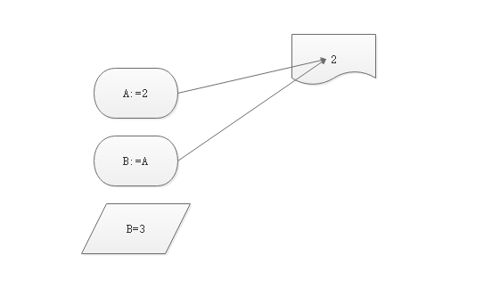
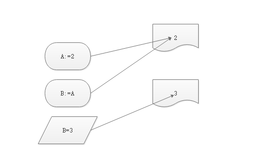
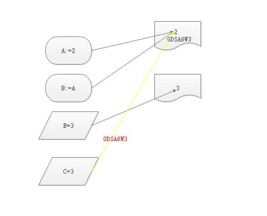

在go语言中的代码文件中最上层会定义一个package声明开头，说明源文件所属的包

而后使用Import导入依赖的包，其次为包级别的变量，产量，类型和函数的什么和赋值

函数中可定义局部的变量和常量等。

如下：

```
package main
import "fmt"
func main(){
  fmt.Println("hello world!")
}
```

package main 中的main是程序的入口。在后面的包管理中会有其他的方式表示

## 1.helo world

### run

通常我们可以使用go run go文件来运行一个go文件。如：

```
[root@LinuxEA /opt/Golang]# go run 01.go 
```

```
[root@LinuxEA /opt/Golang]# go run 01.go 
hello world
```

windows

```
E:\golang\project\src\Golang>go run main.go
hello world!
```

### build

我们可以使用build来编译

```
[root@LinuxEA /opt/Golang]# go build 01.go 
```

而后就会多出来一个main.exe  在这个案例中，运行main.exe和go run main.go一样

windows

```
E:\golang\project\src\Golang>go build main.go

E:\golang\project\src\Golang>main.exe
hello world!
```

linux

```
[root@LinuxEA /opt/Golang]# ./01
hello world
```

### 注释

通常我们使用双斜线来注释一行代码，或者使用/*和\*/来注释一大块的代码，如下：

代码的注释也可以在代码的第一行

```
// 我也是注释
package main
import "fmt"
func main(){
	fmt.Println("hello world!")

	// 双斜杠可以注释一行
	
	/* 
	多行注释
	fmt.Println("hello world!")
	fmt.Println("hello world!")
	*/
}
```

- go build 会省略注释的内容

## 2.程序组成的基本单位

这和其他的语言一般无二。

### 标识符

标识符是编程时候使用的名字，这个名字可以是变量，产量，函数，类型，接口，包，以及后续的结构体都是由名字组成

最终访问的也是通过标识符名字访问的。通过标识符建立名称和使用的关系。

!!! note

	在go语言中的标识符有非空的字母组成（unicode），数字，下划线(_)组成

unicode意味着可以使用中文命名，但是并不建议这么做。

!!! note

	不能使用GO的关键字

go语言中有25个关键字不可以使用：

声明：`import,package`

实体声明和定义：`chan,const,func,interface,map,struct,type,var`

流程控制: `break,case,continue,default,defer,else,fallthrough,for,go,goto,if,range,return,select,switch`

- 避免使用GO预定义的标识符，这些标识符通常内置在go中，不可以使用。如下：

内置产量：` true,false,nil,iota`
内置类型: `bool,byte,rune,int,int8,int16,int32,int64,uint,uint8,uint16,uint32,uint64,uintptr,float32,float64,complex64,complex128,string,error`
内置函数：`make,len,cap,new,append,copy,close,delete,panic,recover,complex,real,imag`
空白标识符： _

- 建议使用驼峰法

```
myNameIs := 
```

- 标识符区分大小写

```
My
my
```

### 字面量

当创建一个linuxea后定义一个字符串类型的变量去赋值，这时候linuxea就是字面量

字面量是值的表示方法，常用与对变量/产量进行初始化。

主要分为：

- 表示基础数据类型值的字面量，如：0,1.1,true,3 + 4i,'a',"你好世界。"
- 自定义复合数据类型字面量，如：type interval int
- 用于表示符合数据类型值的复合字面量，用来构造：array,slice,map,struct的值，如：{1，2，3}

### 操作符

如下：

算数运算符：+，-，*，/，%，++，-- （加，减，乘，除，余，自增，自减）

关系运算符：>,>=,<,<=,==,!=	（大于，大于等于，小于，小于等于，等于，不等于）

逻辑运算符：&&，||，！	（且，或，非）

位运算符：&，|，^,<<,>>,&^  （与，或，取反，左移，右移，按位清除 ）

赋值运算符：=，+=，-=，*=，/=，%=，&=，|=，^=,<<=,>>= （符合赋值）

其他运算符：&（），*（），.(),-(),...,<-  (取地址，取引用，方法调用/属性获取，符号位取反，..., 管道读写)

### 分隔符

小括号(),中括号[],大括号(),分号;,逗号,

## 3.变量语法声明

声明语句用于定义程序的各种实体对象，如：

- var  声明变量

- sonst  声明常量

- func  声明函数

- typ  声明类型

### 变量

什么是变量？

变量是值对一块存储空间的定义名称 ，通过名称对存储空间的内容进行访问或者修改。变量声明的常见语法：

变量的声明必须满足标识语法：

1，定义一个me的变量，并指定变量类型

2，赋值me 值为`linuxea.com`

需要满足标识符的命名规则。

- 必须由非空的unicode字符串组成，数字，_
- 不能是数字开头
- 不能为go的关键字
- 避免和go预定义的(25个)标识符冲突，如：true,false等
- 建议使用驼峰式
- 标识符区分大小写

```
	var me string
	me = "linuxea.com"
```

如下：

```
[root@LinuxEA /opt/Golang]# cat 02.go
package main
import "fmt"
func main(){
	var me string
	me = "linuxea.com"
	fmt.Println(me)
}
```
!!! 警告

	注意：函数体内的变量必须使用，否则会报错

运行

```
[root@LinuxEA /opt/Golang]# go run 02.go 
linuxea.com
```

### 函数外变量

现在我们在函数之外定义一个变量，使用等号=进行赋值

!!! note

	如果定义的变量没有赋值，就会自动赋值一个零值

```
var version string = "www.linuxea.com"
```

如下：

```
package main
import "fmt"
var version string = "www.linuxea.com"
func main(){
	var me string
	me = "linuxea.com"
	fmt.Println(me)
}
```

函数外的变量没有使用是不会报错的。

```
[root@LinuxEA /opt/Golang]# go run 02.go 
linuxea.com
```

### 定义多个变量

通常在定义变量的时候，使用var，每次定义一个。

```
var name string
var age string
```

其实我们可以使用逗号将同一个类型的变量隔开进行定义

```
var name,age string
```

而对多个变量赋值的时候，也可以如此

```
name,age = "mark","18"
```

如下:

```
package main
import "fmt"
var version string = "www.linuxea.com"
func main(){
	var me string
	me = "linuxea.com"
	fmt.Println(me)

	var name,age string
	name,age = "mark","18"
	fmt.Println(name,age)
}
```

运行：

```
[root@LinuxEA /opt/Golang]# go run 02.go 
linuxea.com
mark 18
```

当然了，也可以把不同类型的变量在一起定义，使用括号即可

- 不同类型的多个变量定义

我们可以使用var括号进行定义，比如定义一个tel是int类型的，和一个desc是string类型的，如下：

```
	var (
		tel int
		desc string
	)
```

赋值

```
	tel,desc = 10086,"联通"
	fmt.Println(tel,desc)
```

运行

```
[root@LinuxEA /opt/Golang]# go run 02.go 
linuxea.com
mark 18
10086 联通
```

当然了， 我们也可以在声明的时候进行赋值，如下：

```
	var (
		tel int = 10086
		desc string = "上海"
	)
	fmt.Println(tel,desc)
```

运行结果仍然不变

```
[root@LinuxEA /opt/Golang]# go run 02.go 
linuxea.com
mark 18
10086 上海
```

### 简短声明

然而，在定义变量的时候，可以不指定类型，go会根据赋值类型自动推导，但是必须赋值，如下：

!!! note

	使用`:=`冒号等于做简短赋值，左边是变量名，右边是值

```
tel,desc := 10010,"上海市淞虹路"
```

```
fmt.Println(tel,desc)
```
运行

```
[root@LinuxEA /opt/Golang]# go run 02.go 
10010 上海市淞虹路
```
### var与简短声明的区别

!!! note

	> 注意：这里使用了简短声明，没有使用var声明 。在函数体内可以使用简短声明。而在函数体外必须使用var 定义，如下，go会根据值类型进行自动推导类型

```
package main
var tel,desc = 10010,"上海市淞虹路"
func main(){}  // 函数体
```
或
```
package main
var (
		tel int = 10086
		desc string = "上海"
	)
	func main(){}	// 函数体
```
### 重复赋值
!!! note

	> ！注意：变量只能声明一次，不能重复定义，但是可以重复赋值
```
 	tel := 10086
 	desc := "上海"
```
重复赋值，重复赋值只需要等号即可
```
 	tel = 10010
	desc = "北京"
```
运行结果是最近的赋值结果
```
[root@LinuxEA /opt/Golang]# go run 03.go 
10010 北京
```

### 值交换

当一次定义了多个值的时候就可以进行交换，这个方式很简单，如下：

```
	tel,desc := "10010","上海"
	fmt.Println(tel,desc)
	tel,desc = desc,tel
	fmt.Println(tel,desc)
```

```
package main
import "fmt"
var version string = "www.linuxea.com"
func main(){
	tel,desc := "10010","上海"
	fmt.Println(tel,desc)
	tel,desc = desc,tel
	fmt.Println(tel,desc)
}
```

运行

```
[root@LinuxEA /opt/Golang]# go run 03.go 
10010 上海
上海 10010
```

!!! note

	> 注意：这里交换的值必须是同类型。

## 4.常量

常量和变量不同，变量是可以赋值进行修改的，而常量是不能修改的。在使用中有一些值是我们不希望更改的，就可以声明成常量。通常，我们习惯与将常量写为大写。

### 定义一个常量

常量可以定义在函数体内和函数体外

```
	const name string = "mark"
	fmt.Println(name)
```

运行

```
[root@LinuxEA /opt/Golang]# go run 04.go 
mark
```

如果进行赋值修改就会报错

```
# command-line-arguments
./04.go:6:7: cannot assign to name
```

### 省略类型

```
	const PP = 32132.21
	fmt.Println(PP)
```

运行

```
[root@LinuxEA /opt/Golang]# go run 04.go 
32132.21
```

### 定义多个类型相同的常量

```
	const P1,P2 int  = 3,4
	fmt.Println(P1,P2)
```

运行

```
[root@LinuxEA /opt/Golang]# go run 04.go 
3 4
```

### 定义多个类型不相同的常量

```
	const (
		P1 string = "mark"
		P2 int  = 4
	)
	fmt.Println(P1,P2)
```

运行

```
[root@LinuxEA /opt/Golang]# go run 04.go 
mark 4
```

### 定义多个常量省略类型

```
	const (
		P1  = "mark"
		P2  = 4
		P3 = 32.1
	)
	fmt.Println(P1,P2,P3)
```

运行

```
[root@LinuxEA /opt/Golang]# go run 04.go 
mark 4 32.1
```

### 赋值省略

在go中，如果产量的第一个值和最后一个值都是一样的，就可以省略掉。如下：

```
const (
	P1  = 1
	P2
	P3
)
fmt.Println(P1,P2,P3)	
```

运行

```
[root@LinuxEA /opt/Golang]# go run 04.go 
1 1 1
```

还可以像这样

```
const (
	P1  = "mark"
	P2
	P3
	P100 = 3.5
	P101
	C11 = 123
	C12
)
fmt.Println(P1,P2,P3,P100,P101,C11,C12)
```

运行

```
[root@LinuxEA /opt/Golang]# go run 04.go 
mark mark mark 3.5 3.5 123 123
```

### 枚举

这种方式可以应用在枚举上，const+iota

> 枚举是以const()括号内部开始和结束的。不影响到括号外的操作。

```
const (
	B1 int = iota
	B2
	B3
	B4
)
fmt.Println(B1,B2,B3,B4)
```

运行

```
[root@LinuxEA /opt/Golang]# go run 04.go 
0 1 2 3
```

## 5.作用域

作用于定义标识符可以使用的范围。在go中使用`{}`定义作用域的范围。在{}中可以嵌套语句块。

但是，子语句快可以使用父语句块，父语句快不可以使用子语句块。如下所示就会报：`undefined: inner`.因为在{}外是不能调用{}内的`inner := 2`

```
	outer := 1
	{
		inner := 2
		fmt.Println(outer)
		fmt.Println(inner)
	}
	fmt.Println(inner)
```

子语句快可以使用父语句块

```
outer := 1
{
	inner := 2
	fmt.Println(outer)
	fmt.Println(inner)
	{
		inner2 := 3
		fmt.Println(outer,inner,inner2)
	}
}
//fmt.Println(inner)
```

运行

```
[root@LinuxEA /opt/Golang]# go run 05.go 
1
2
1 2 3
```

假如在语句块中嵌套了很多层，那么调用的流程就是就近调用。

```
outer := 1
{
	inner := 2
	outer := 11
	fmt.Println(outer)
	fmt.Println(inner)
	{
		inner2 := 3
		fmt.Println(outer,inner,inner2)
	}
}
fmt.Println(outer)

```

运行

```
[root@LinuxEA /opt/Golang]# go run 05.go 
11
2
11 2 3
1
```

## 6.fmt与占位符

fmt.Println("打印")  打印的同时还会进行换行，而fmt.Print("打印")  是不会换行的。另外fmt.Printf()可以打印变量的类型：

```
a := "linuxea"
fmt.Printf("%T,%s,%d\n",a,"linuxea",1)
```

```
[root@LinuxEA /opt/Golang]# go run 05.go 
string,linuxea,1
```

有时候会出现`%!s`之类的，就说明占位符不匹配。需要使用对应的类型

- 普通占位符

```
占位符     说明                           举例                   输出
%v      相应值的默认格式。            Printf("%v", people)   {zhangsan}，
%+v     打印结构体时，会添加字段名     Printf("%+v", people)  {Name:zhangsan}
%#v     相应值的Go语法表示            Printf("#v", people)   main.Human{Name:"zhangsan"}
%T      相应值的类型的Go语法表示       Printf("%T", people)   main.Human
%%      字面上的百分号，并非值的占位符  Printf("%%")            %
```

- 布尔占位符

```
占位符       说明                举例                     输出
%t          true 或 false。     Printf("%t", true)       true
```

- 整数占位符

```cp
占位符     说明                                  举例                       输出
%b      二进制表示                             Printf("%b", 5)             101
%c      相应Unicode码点所表示的字符              Printf("%c", 0x4E2D)        中
%d      十进制表示                             Printf("%d", 0x12)          18
%o      八进制表示                             Printf("%d", 10)            12
%q      单引号围绕的字符字面值，由Go语法安全地转义 Printf("%q", 0x4E2D)        '中'
%x      十六进制表示，字母形式为小写 a-f         Printf("%x", 13)             d
%X      十六进制表示，字母形式为大写 A-F         Printf("%x", 13)             D
%U      Unicode格式：U+1234，等同于 "U+%04X"   Printf("%U", 0x4E2D)         U+4E2D
```

- 浮点数和复数的组成部分

```cpp
占位符     说明                              举例            输出
%b      无小数部分的，指数为二的幂的科学计数法，
        与 strconv.FormatFloat 的 'b' 转换格式一致。例如 -123456p-78
%e      科学计数法，例如 -1234.456e+78        Printf("%e", 10.2)     1.020000e+01
%E      科学计数法，例如 -1234.456E+78        Printf("%e", 10.2)     1.020000E+01
%f      有小数点而无指数，例如 123.456        Printf("%f", 10.2)     10.200000
%g      根据情况选择 %e 或 %f 以产生更紧凑的（无末尾的0）输出 Printf("%g", 10.20)   10.2
%G      根据情况选择 %E 或 %f 以产生更紧凑的（无末尾的0）输出 Printf("%G", 10.20+2i) (10.2+2i)
```

- 字符串与字节切片

```
占位符     说明                              举例                           输出
%s      输出字符串表示（string类型或[]byte)   Printf("%s", []byte("Go语言"))  Go语言
%q      双引号围绕的字符串，由Go语法安全地转义  Printf("%q", "Go语言")         "Go语言"
%x      十六进制，小写字母，每字节两个字符      Printf("%x", "golang")         676f6c616e67
%X      十六进制，大写字母，每字节两个字符      Printf("%X", "golang")         676F6C616E67
```

- 指针

```
占位符         说明                      举例                             输出
%p      十六进制表示，前缀 0x          Printf("%p", &people)             0x4f57f0
```

- 其它标记

```
占位符      说明                             举例          输出
+      总打印数值的正负号；对于%q（%+q）保证只输出ASCII编码的字符。 
                                           Printf("%+q", "中文")  "\u4e2d\u6587"
-      在右侧而非左侧填充空格（左对齐该区域）
#      备用格式：为八进制添加前导 0（%#o）      Printf("%#U", '中')      U+4E2D
       为十六进制添加前导 0x（%#x）或 0X（%#X），为 %p（%#p）去掉前导 0x；
       如果可能的话，%q（%#q）会打印原始 （即反引号围绕的）字符串；
       如果是可打印字符，%U（%#U）会写出该字符的
       Unicode 编码形式（如字符 x 会被打印成 U+0078 'x'）。
' '    (空格)为数值中省略的正负号留出空白（% d）；
       以十六进制（% x, % X）打印字符串或切片时，在字节之间用空格隔开
0      填充前导的0而非空格；对于数字，这会将填充移到正负号之后
```

- 填充补充

占位填充`%5d`,占位5位，`%05d`占位5位，缺省的用0填充

```
	age = 17
	fmt.Printf("%5d\n",age)		//   17
	fmt.Printf("%05d\n",age)	//00017
```
运行
```
[root@LinuxEA /opt/Golang]# go run int.go 
   17
00017
```
- 左对齐右对齐

默认是右对齐，如果是`%-5d`，就变成了右对齐

```
fmt.Printf("%-5d\n",age)
fmt.Printf("%05d\n",age)
```

运行

```
[root@LinuxEA /opt/Golang]# go run int.go 
17   
00017
```


## 7.布尔类型

布尔类型用于表示真假，类型名为bool，只有两个值,分别是true和false。0值默认是false

```
package main
import "fmt"
func main(){
	
	var hhlo bool
	helo := true
	hell := false
	fmt.Println(hhlo,helo,hell)
}
```

运行

```
[root@LinuxEA /opt/Golang]# go run bool.go 
false true false
```

true表示真，false表示假，零值为false，字面量也是true/false

### 布尔操作

- 逻辑运算

逻辑运算有三个，`与，或，非`。`与&&`，`或||`，`非！`

与：`abool && bbool`，当两个都为true的时候，结果为true。如果有一个结果为false就不是true.

或：`abool || bbool`，只要有一个为true的时候，结果就为true。

非：`!true`，取反。`!true`非true，也就是false；`!false`非false，也就是true；可以是字面量，也可以是变量。

- 关系运算

关系运算的结果也是true和false.  `(==,!=)`，等于和不等于。

```
	helo := true
	hell := false
	fmt.Println(helo != hell)		// true
	fmt.Println(helo == hell)		// false
```

## 8.数值类型

整型，go提供了5种有符号，5种无符号，1种指针，1种单字节，一种单个unicode字符(unicode码点)，共13种整数类型，零值均为0.

标识符：`int,uint,rune,int8,int16,int32,int64,uint8,uint16,uint32,uint64,byte,uintptr`,其中最为常用的是int类型，rune是单个unicode字符(unicode码点),int8表示8位的Int类型，int16表示int 16位等等。u开头的是无符号，uint8是无符号int8位，uint16是无符号int16位等等。byte一个字节，八位。uintptr是指针类型，与系统有关。

有符号的，0表示正数，1表示负数。表示范围8字节是2^7-2^7-1；无符号表示正数，表示范围是0-2^8-1是256.

- int

```
package main
import "fmt"
func main(){
	var age int = 18
	fmt.Printf("%T %d",age,age)	// int 18
}
```

打印类型和数值`%T`和`%d`。`fmt.Printf("%T %d",age,age)`

### 算数运算

- 加减乘除余

除数不能为0

```
	fmt.Println(9 - 5)	//4
	fmt.Println(3 * 3)	//9
	fmt.Println(3 + 3)	//6
	fmt.Println(9 / 2)	//4
	fmt.Println(9 % 2)	//1
```

### 自增和自减

`++`加1，`--` 减1

```
package main
import "fmt"
func main(){
	var age int = 18
	age = 18
	age++
	fmt.Printf("age++:%d\n",age)
	age--
	fmt.Printf("age--:%d\n",age)
}
```

运行

```
[root@LinuxEA /opt/Golang]# go run int.go 
age++:19
age--:18
```

### 关系运算

`==`等于，`!=`不等于,`>`大于，`>=`大于等于,`<`小于,`<=`小于等于

```
package main
import "fmt"
func main(){
	fmt.Println(1 == 1)
	fmt.Println(2 != 1)
	fmt.Println(2 > 3)
	fmt.Println(2 >= 3)
	fmt.Println(2 < 3)
	fmt.Println(2 <= 3)
}
```

运行结果

```
true
true
false
false
true
true
```

### 位运算

位运算实际上是对二进制进行计算，10进制需要转换成二进制进行计算

`& `与 ，`|`或 ，`^`亦或， `<<`左移，`>>`右移，`&^`按位清空

```
	fmt.Println(7 & 2)		// 2
	fmt.Println(7 | 2)		// 7
	fmt.Println(7 ^ 2)		// 5
	fmt.Println(7 << 2)		// 28
	fmt.Println(7 >> 2)		// 1
	fmt.Println(7 &^ 2)		// 5
```

这里使用了辗转相除法也可以运算。

### 赋值运算

赋值同时可以进行计算，如,`=,+=，-=，*=，/=，%=，&=，|=，<<=,>>==,&^=`

`a+b` 等于 `a = a+b`

```
	age = 1
	age += 3
	fmt.Println(age)		// 1+3=4
	
	age -= 2
	fmt.Println(age)		// 4-2=2 	
```

### 类型转换

如果两个不同的类型进行运算的时候就需要进行强转换。如果不进行转换就会出错

```
	var int1 int = 10
	var int2 uint = 2
	fmt.Println(int1 + int2)
```

当运行时候会抛出错误

```
[root@LinuxEA /opt/Golang]# go run int.go 
# command-line-arguments
./int.go:44:19: invalid operation: int1 + int2 (mismatched types int and uint)
```

这时候必须将两个变量的类型转换一致，且不管是int或者uint，只要一致即可。如下：

```
	var int1 int = 10
	var int2 uint = 2
	fmt.Println(int1 + int(int2))		// int2的uint转换成int
	fmt.Println(uint(int1) + int2)		// int1的int转换成uint
	fmt.Printf("%T %T",int1,int2)		// int uint
```

运行

```
[root@LinuxEA /opt/Golang]# go run int.go 
12
12
int uint
```

- 注意

我们需要注意的是，当一个int32转换成int8的时候，可能会出现溢出。或者如下的16进制转换：

```
	var int3 int = 0XFFFF
	fmt.Println(int3)				// 65535
	fmt.Println(uint8(int3))		// 255
	fmt.Println(int8(int3))			// -1
	fmt.Printf("%T",int3)			// int
```

从大向小转换的时候就可能会出现溢出的问题。

### 字节与码点

byte是字节，rune表示码点。这两个在赋值的时候可以使用单引号，而int也可以实现，不过int使用的是十进制。当然，byte和rune也是int类型

```
	var a byte = 'A'
	var b rune = '测'
	fmt.Println(a,b)		// 65 27979
	fmt.Printf("%T %T",a,b)	// uint8 int32
```

对于码点的打印使用%U，使用`%q`打印字面量的值

```
fmt.Printf("%q %q",a,b)		// 'A' U+6D4B
```

这里可以做个简单的转换，二进制使用`%b`,八进制`%o`，十六进制`%x`

```
age = 17
fmt.Printf("%T %d %b %o %x\n",age,age,age,age,age)		// int 17 10001 21 11
```

## 9.浮点数

在go中浮点有两种类型，一种是float64，一种是float32。一般使用float64即可

### 定义与赋值

默认是0值

```
package main
import "fmt"
func main(){
	var floatt float64
	fmt.Println(floatt)
}
```

运行

```
[root@LinuxEA /opt/Golang]# go run float.go 
0
```

- 赋值

```
	var floatt float64
	floatt = 1.666
```

```
package main
import "fmt"
func main(){
	var floatt float64
	floatt = 1.666
	fmt.Printf("%T %f",floatt,floatt)
}
```

运行

```
[root@LinuxEA /opt/Golang]# go run float.go
float64 1.666000
```

### 字面量

字面量 也分为十进制表示法和科学技术表述法

- 十进制表示法

如：1.666 ,2.666

```
floatt = 1.666
```

- 科学技术表述法

如:

```
floatt = 12.02E1
```

这需要换算

### 算数运算

+，-，*，/,++,--。在float中通常不进行自增和自减，而且也不支持`(%)`余运算

```
fmt.Println(1.11 + 1.2)
fmt.Println(1.11 - 1.2)
fmt.Println(1.11 * 1.2)
fmt.Println(1.11 / 1.2)
```

运行结果

```
[root@LinuxEA /opt/Golang]# go run float.go
2.31
-0.09
1.332
0.925
```
与整数一样，被除数的不能为0
- 自增和自减

```
floatt = 1.063
floatt++
fmt.Println(floatt)
floatt--
fmt.Println(floatt)
```

运行结果

```
[root@LinuxEA /opt/Golang]# go run float.go
2.0629999999999997
1.0629999999999997
```
!!! note

	> 浮点数不是精确存储，在加减过程中会有一定的精度损耗。
	> 如上述中的 1.063在运算后精度损耗会变大，打印时候是1.0629999999999997

### 关系运算

由于有精度损耗，对于浮点数来说，不计算等于和不等于。 一般来讲之计算大于`>`，大于等于`>=`，小于`<`，小于等于`<=`，或者约等于`~=`

```
fmt.Println(1.11 > 1.2)
fmt.Println(1.11 >= 1.2)
fmt.Println(1.11 < 1.2)
fmt.Println(1.11 <= 1.2)
```

运行结果

```
[root@LinuxEA /opt/Golang]# go run float.go
false
false
true
true
```

- 等于判断

判断浮点数是否等于，可以先进行相减，而后在做比较区间值。如下：

> 最终的判断取决于精确到的位数

```
fmt.Println(1.11 - 1.2 <= 0.005)
```

运行结果

```
[root@LinuxEA /opt/Golang]# go run float.go
true
```

浮点数是没有位运算的，直接看赋值运算

### 赋值运算

等于`=`，加等于`+=`，减等于`-=`，乘等于`*=`，除等于`/=`

```
	floatt = 1.063
	floatt += 2.25
	fmt.Println(floatt)
	floatt -= 2.25
	fmt.Println(floatt)
	floatt *= 2
	fmt.Println(floatt)
	floatt /= 2
	fmt.Println(floatt)
```

运行结果

```
[root@LinuxEA /opt/Golang]# go run float.go
3.3129999999999997
1.0629999999999997
2.1259999999999994
1.0629999999999997
```

### 类型转换

我们知道，默认的是float64。现在转到float32。`float32(zsh)` 转换到float32

```
zsh := 1.16389366
fmt.Printf("%T %T\n",zsh,float32(zsh))
fmt.Println(zsh,float32(zsh))
```

运行

```
[root@LinuxEA /opt/Golang]# go run float.go
float64 float32
1.16389366 1.1638937
```

!!! Warning

	>如果数据太大，转换后会进行截断

### 保留数

比如，现在我要保留五位，并且包含3个小数点-`%5.3f`。如下：

> 如果小数点和位数不满足，将用空格替代

```
fmt.Printf("%5.3f\n",zsh)
```

运行

```
[root@LinuxEA /opt/Golang]# go run float.go 
1.164
```

### complex复数

Go提供了两种大小的复数类型：complex64和complex128，分别由float32和float64组成。内置函数complex从指定的实部和虚部构建复数，内置函数real和imag用来获取复数的实部和虚部：

如果一个浮点数的字面量后面跟着一个i，例如2i，那么它将变成一个复数的虚部，这个复数的实部是0：

```
	ii := 1 + 2i
	fmt.Printf("%T %v",ii,ii)
```

运行

```
[root@marksugar /opt/Golang]# go run float.go 
complex128 (1+2i)
```

complex128是指实部和虚部都使用的是float64

## 10.字符串

### 定义字符串

我们在定义字符串的时候，使用双引号和反引号来赋值

```
	var name string = "mark"
	var desc string = `我是字符串`
	fmt.Println(name,desc)
```

双引号是可解释的字符串，反引号是原生字符串

```
[root@marksugar /opt/Golang]# go run string.go 
mark 我是字符串
```

在字符串中有一些特殊字符，如:`\n,\f,\t,\r,\b,\v`

```
	var name string = "ma\trk"
	var desc string = `我是\t字符串`
	fmt.Println(name,desc)
```

这里的`\t`是一个tab,也就是4个空格

```
[root@marksugar /opt/Golang]# go run string.go 
ma	rk 我是\t字符串
```

### 算数运算

可以使用+进行字符串的链接

```
	var name string = "mark"
	var desc string = `是字符串`
	fmt.Println(name+desc)
```

运行

```
[root@marksugar /opt/Golang]# go run string.go 
mark是字符串
```

### 关系运算

关系运算分为：`==,!=,>,>=,<,<=`

```
	fmt.Println("a" == "b")  是否等于
	fmt.Println("a" != "b")  是否不等于
	fmt.Println("a" < "b")   是否小于
	fmt.Println("a" > "b")   是否大于
	fmt.Println("aa" <= "b")  是否小于等于
	fmt.Println("a" >= "bb")  是否大于等于
```

运算大小比较是根据ASCII 码，从左到右进行比较：

```
[root@marksugar /opt/Golang]# go run string.go 
false
true
true
false
true
false
```

### 赋值运算

```
	s := "my name is "
	s += "mark"
	fmt.Println(s)
```

运算

````
[root@marksugar /opt/Golang]# go run string.go 
my name is mark
````

### 索引

索引计算是0-n-1，n是字符串长度.

```
	desc = "abcdefg"
	fmt.Printf("%T %c\n",desc[0],desc[0])
```

`desc[0]`，0对应a，从左到右，索引类型是`uint8`，这里打印使用的是`%c`
运行

```
[root@marksugar /opt/Golang]# go run string.go 
uint8 a
```

### 切片

字符串定义内容必须是`ascii`

切片是从哪里到哪里，比如：从1到3--`desc = "abcdefg"`，从左到右，1到3则是`bc`，切片类型`string`，这里打印使用的是`%s`

>
>		fmt.Printf("%T %s\n",desc[start:end],desc[start:end])
>	
>	end不能超过字符串的长度


```
fmt.Printf("%T %s\n",desc[1:3],desc[1:3])
```

运行

```
[root@marksugar /opt/Golang]# go run string.go 
string bc
```

!!!  字符串定义内容必须是`ascii`是因为在切片或者索引的时候会出现乱码，特别是在中文字符的时候。如下：

```
	desc = "我我我"
	fmt.Printf("%T %c\n",desc[0],desc[0])
    fmt.Printf("%T %s\n",desc[1:3],desc[1:3])
```

运行:

```
[root@marksugar /opt/Golang]# go run string.go 
uint8 æ
string  
```

### 字符串长度

字符串长度也需要是`ascii`码，才能精准计算，而中文字符可能使用到三到四个字节。

```
	desc = "abcdefg"
	fmt.Println(len(desc))

	desc = "我我我"
	fmt.Println(len(desc))
```

运行

```
[root@marksugar /opt/Golang]# go run string.go 
7
9
```

所以这里`desc = "我我我"`len计算是9。而中文字符串有其他方式。

### 去掉最后一位

如果你要取最后一位则是`len(desc)-1)`

```
	desc = "abcdefg"
	fmt.Println("desc:",len(desc))
	fmt.Println("desc:",len(desc)-1)
```

如下：

```
[root@marksugar /opt/Golang]# go run string.go 
desc: 7
desc: 6
```

## 11.指针

### 认识指针

通常变量存储在内存空间，如下图

A存储在2，而后赋值`B=A`




此刻，设置B赋值3，那么赋值是否对A有影响

```
package main
import "fmt"
func main(){
	A := 2
	B := A
	B = 3
	fmt.Printf("A:%d B:%d",A,B)
}
```

运行

```
[root@marksugar /opt/Golang]# go run zhizhen.go
A:2 B:3
```

上述A是2，B是3，说明赋值给B的3是没有影响到A的值，B是单独的一个值，如下：



如果我一定要通过赋值修改A的值，就可以使用指针来进行修改。

如上述中。假如，A赋值的2存储在内存中的地址编号是`0DSA6W3`，此刻要修改就需要使用A存储的的内存地址进行修改。如下：



### 定义指针

使用`&`符号取变量地址，而这个类型也是`*int`,这个类型就是指针类型。

!!! 如果是一个字符串就是`*string`，如果是bool就是`*bool`,如果是浮点数就是`*float64`.

我们定义一个C的指针

```
var C *int
```

简短声明

```
	A := 2
	B := A
	B = 3
	fmt.Printf("A:%d B:%d\n",A,B)

	C := &A
	fmt.Printf("%T",C)
```

运行

```
[root@marksugar /opt/Golang]# go run zhizhen.go 
A:2 B:3
*int
```

### 获取指针值

如果要获取指针的值就需要使用*变量。如：`\*c`

```
A := 2
C := &A
fmt.Printf("%T %p",C,*C)
```

```
[root@marksugar /opt/Golang]# go run zhizhen.go 
A:2 B:3
*int 2
```

### 修改指针值

```
	A := 2
	C := &A
	*C = 666
	fmt.Print(*C)
```

```
[root@marksugar /opt/Golang]# go run zhizhen.go
666
```

golang中的指针没有复杂的运算，相对来讲是安全的。

### 指针的应用

使用指针

```
package main
import "fmt"
func main(){
	var name string
	var age int
	var height float64
	fmt.Print("请输入你的名字: ")
	fmt.Scan(&name)
	fmt.Print("请输入你的年龄: ")
	fmt.Scan(&age)
	fmt.Print("请输入你的身高: ")
	fmt.Scan(&height)
	fmt.Printf("你输入的是名字是: [%s]\n输入的年龄是: [%d]\n输入的身高是: [%f]",name,age,height)
}
```

运行后输入：

```
[root@marksugar /opt/Golang]# go run zhizhen2.go 
请输入你的名字: mark
请输入你的年龄: 18
请输入你的身高: 1.7
你输入的是名字是: [mark]
输入的年龄是: [18]
输入的身高是: [1.700000]
```

现在你必须按照类型输入。

!!! Warning

	指针的空值是nil