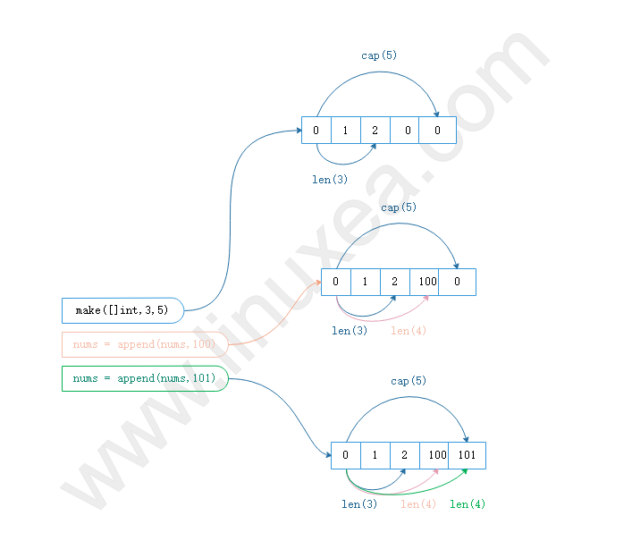
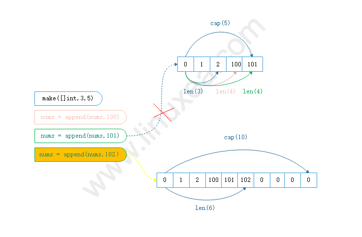
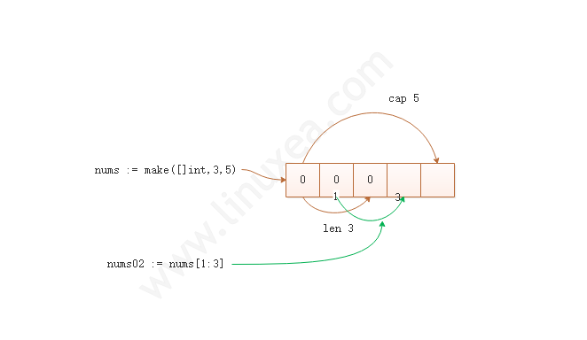
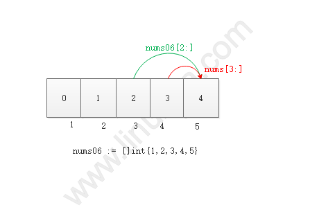
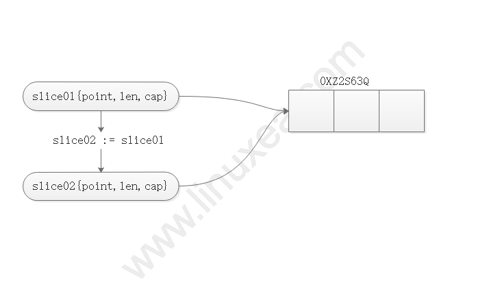
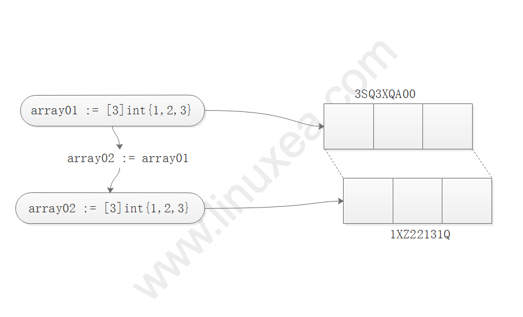

  复合数据类型是集合类，并且可以存储多个单值。

## 1.数组

在golang中存储的数组是相同的数据类型，并且长度也是其中的一个属性。在go中，数组的长度一旦定义，就不可变。如果声明了长度的变量，只能赋值相同的长度的数组

数组是具有相同数据类型的数据项组成一组长度固定的序列，数据项叫做数组的元素，数组的长度必须是非负整数的常量，长度也是类型的一部分。

### 1.2 数组的声明

声明数组组成的元素类型以及存储的元素长度，一旦数组长度设置后不可以更改，数组的每个元素会根据对应类型的零值进行初始化。

使用var进行声明即可，长度和类型

```
var nums [10]int
```

如上，数组使用中括号[]，上述表示一个长度为10的int类型数组。

```
package main

import "fmt"

func main() {
	var nums [10]int
	fmt.Printf("%T ", nums)
	fmt.Println("\n", nums)
}
```

我们可以打印下这个nums

```
[root@www.linuxea.com /opt/Golang/work2]# go run array.go 
[10]int 
[0 0 0 0 0 0 0 0 0 0]
```

!!! note
当定义了[10]int的时候，就会在内存申请10个int类型的元素。元素内的值是对应类型的零值存放。

所以，这里打印的是10个0。

我们可以多定义几个其他类型

```
package main

import "fmt"

func main() {
	var nums [10]int
	var t1 [5]bool
	var t2 [3]string
	fmt.Printf("%T ", nums)
	fmt.Println("\n", nums)
	fmt.Println(t1)
	fmt.Printf("%q",t2)
}
```

- %q可以打印空字符串带""，便于查看

运行结果如下：

```
[root@www.linuxea.com /opt/Golang/work2]# go run array.go 
[10]int 
 [0 0 0 0 0 0 0 0 0 0]
[false false false false false]
["" "" ""]
```

分别是，10个0，5个false，3个空字符串

### 1.2数组的赋值

赋值的时候，需要和定义时候一样，假如你赋值如下:

```
nums = [10]int{}
```

这和上面定义的变量是一样，因为{}是空，都会是0值。

我们设置1~5

```
package main

import "fmt"

func main() {
	var nums [10]int
	nums = [10]int{1,2,3,4,5}
	fmt.Println(nums)
}	
```

> 这里也可以简短声明: nums := [10]int{1,2,3,4,5}

运行：

```
[root@www.linuxea.com /opt/Golang/work2]# go run array.go 
[1 2 3 4 5 0 0 0 0 0]
```

这时候你会发现，赋值是正确了，但是仍然打印了10个元素，前五个被赋值了，没有赋值的仍然是0.

### 1.3数组索引赋值 

我们在换种方式，对第一个和最后一个进行赋值。

如果要进行这种赋值操作，必须使用索引，第一个就是0，最后一个就是9。

将第一个赋值为10，最后一个赋值为20，如下：

```
nums = [10]int{0:10,9:20}
```

运行

```
[root@www.linuxea.com /opt/Golang/work2]# go run array.go 
[10 0 0 0 0 0 0 0 0 20]
```

我们也可以使用`[...]`来省略长度，但是必须输够长度

我们可以使用`[...]`的方式来进行自动推导有多少数组，而不是设置一个固定的值

```
package main

import "fmt"

func main() {
	var nums [10]int
    nums = [...]int{0:10,9:20}
 
}	
```

运行

```
[root@www.linuxea.com /opt/Golang/work2]# go run array.go 
[10 0 0 0 0 0 0 0 0 20]
```

或者这样

```
nums02 := [...]int{1,2,3,4}
```

```
package main

import "fmt"

func main() {
	nums02 := [...]int{1,2,3,4}
	fmt.Println(nums02)
}
```

运行

```
[root@www.linuxea.com /opt/Golang/work2]# go run array1.go 
[1 2 3 4]
```

### 1.4数组的操作

定义nums01和nums02数组进行判断

```
package main

import "fmt"

func main() {
	nums01 := [...]int{0,1,2,3}
	nums02 := [...]int{1,2,3,4}
	fmt.Println(nums02 == nums01)
}
```

运行

```
[root@www.linuxea.com /opt/Golang/work2]# go run array1.go 
false
```

或者不等于

```
package main

import "fmt"

func main() {
	nums01 := [...]int{0,1,2,3}
	nums02 := [...]int{1,2,3,4}
	fmt.Println(nums02 != nums01)
}
```

运行

```
[root@www.linuxea.com /opt/Golang/work2]# go run array1.go 
true
```

>!!! warning
如果长度不相等是不能进行运算.
可以使用len计算数组的长度

### 1.5数组的索引操作

```
nums02 := [...]int{1,2,3,4}
```

我们现在获取位于2和3的索引位置的数据.

> - 索引范围必须在可选值内 ，0~ len-1

```
package main

import "fmt"

func main() {
	nums02 := [...]int{1,2,3,4}
	fmt.Println(nums02[1],nums02[2])
}
```

运行

```
[root@www.linuxea.com /opt/Golang/work2]# go run array1.go 
2 3
```

- 修改

将索引0改成666

```
nums02 := [...]int{1,2,3,4}
```

```
nums02[0] = 666
```

而后在打印这个修改的索引0

```
fmt.Println(nums02[0])
```

运行

```
[root@www.linuxea.com /opt/Golang/work2]# go run array1.go 
666
```

这里已经被修改。

### 1.6数组的遍历

- 使用for遍历上述的数组

```
package main

import "fmt"

func main() {
	nums02 := [...]int{1,2,3,4}
	nums02[0] = 666
	for i :=0; i< len(nums02); i++{
		fmt.Println(i,":",nums02[i])
	}
}
```

运行

```
[root@www.linuxea.com /opt/Golang/work2]# go run array1.go 
0 : 666
1 : 2
2 : 3
3 : 4
```

- for range遍历

```
package main

import "fmt"

func main() {
	nums02 := [...]int{1,2,3,4}
	nums02[0] = 666
	for index,value := range nums02 {
		fmt.Println(index,":",value)
	}
}
```

运行

```
[root@www.linuxea.com /opt/Golang/work2]# go run array1.go
0 : 666
1 : 2
2 : 3
3 : 4
0 : 666
```

我们也可以使用下划线，空白符来不接收

```
package main

import "fmt"
func main() {
	nums02 := [...]int{1,2,3,4}
	nums02[0] = 666
	for _,value := range nums02 {
		fmt.Println(value)
	}
}
```

运行

```
[root@www.linuxea.com /opt/Golang/work2]# go run array1.go 
666
2
3
4
```

###1.7数组的切片操作

切片可以获取一部分，字符串和数组都可以获取一部分。如下

> 和之前字符串一样，end不能超过其长度，最多和长度一样。

我们设置start为0，end为3，我们先看下这个切片的类型

```
package main

import "fmt"

func main() {
	var nums [10]int
    nums = [10]int{1,2,3,4,5}
	fmt.Printf("%T",nums[1:10])
}
```

运行

```
[root@www.linuxea.com /opt/Golang/work2]# go run array.go
[]int
```

数组切片之后的并不是是数组，而是另外的切片。

>* 切片在字符串是用字符串的某一段组成的新的字符串。
>* 切片在数组是数组中的元素组成一个新的集合。


在切片之后还可以跟一个值，这个值是容量，但是仍然不可以超过最大值。

```
package main

import "fmt"

func main() {
	var nums [10]int
    nums = [10]int{1,2,3,4,5}
	fmt.Printf("%T",nums[1:10])
	fmt.Printf("%T",nums[1:10:10])
}
```

```
[root@www.linuxea.com /opt/Golang/work2]# go run array.go
[]int[]int
```

## 2.多维数组

多维数组中是不可以用自动推导的。

### 2.1多维数组的定义

数组中的多维数组。定义一个数组长度为3，并定义长度为2的int数组，如下：

```
[3][2]int
```

[3]为元素的数量，[2]int为类型，2是长度

```
package main

import "fmt"

func main() {

	var marrays [3][2]int
	fmt.Println(marrays)
}
```

打印

```
[root@www.linuxea.com /opt/Golang/work2]# go run array2.go 
[[0 0] [0 0] [0 0]]
```

### 2.2多维数组的查询

和数组一样，我们使用索引查看第一数组，直接使用索引即可，如下:

```
fmt.Println(marrays[0])
```

如果访问的是索引为0中的第一个元素，如下：

```
fmt.Println(marrays[0][0])
```

如下：

```
package main

import "fmt"

func main() {

	var marrays [3][2]int
	fmt.Println(marrays)
	fmt.Println(marrays[0])
	fmt.Println(marrays[0][0])
}
```

打印

```
[root@www.linuxea.com /opt/Golang/work2]# go run array2.go
[[0 0] [0 0] [0 0]]
[0 0]
0
```

### 2.3多维数组的修改

尝试对第一个索引元素修改。

索引0，长度为2的int类型，修改如下：

```
marrays[0] = [2]int{1,2}
```

如下：

```
package main

import "fmt"

func main() {

	var marrays [3][2]int
	marrays[0] = [2]int{1,2}
	fmt.Println(marrays)
}
```

打印：

```
[root@www.linuxea.com /opt/Golang/work2]# go run array2.go 
[[1 2] [0 0] [0 0]]
```

在修改索引为1的元素

```
	marrays[1] = [2]int{100,200}
	fmt.Println(marrays)
```

如下：

```
package main

import "fmt"

func main() {

	var marrays [3][2]int
	marrays[0] = [2]int{1,2}
	fmt.Println(marrays)
	marrays[1] = [2]int{100,200}
	fmt.Println(marrays)

}
```

运行：

```
[root@www.linuxea.com /opt/Golang/work2]# go run array2.go 
[[1 2] [0 0] [0 0]]
[[1 2] [100 200] [0 0]]
```

多维数组也可以进行遍历的。如下：

```
package main

import "fmt"

func main() {
	var marrays [3][2]int
	marrays[0] = [2]int{1,2}
	marrays[1] = [2]int{100,200}

	for index,key := range marrays {
		fmt.Println(index,key)
	}
}
```

运行

```
[root@www.linuxea.com /opt/Golang/work2]# go run array2.go 
0 [1 2]
1 [100 200]
2 [0 0]
```

### 2.4多维度数组字面量

多维数组中是不可以用自动推导的。

```
[root@www.linuxea.com /opt/Golang/work2]# cat array2.go
package main

import "fmt"

func main() {
	marrays = [3][2]int{{1,2},{3,4},{5,6}}
	fmt.Println(marrays)
}
```

运行

```
[root@www.linuxea.com /opt/Golang/work2]# go run array2.go 
[[1 2] [3 4] [5 6]]
```

## 3.三维数组

### 3.1三维数组定义

定义一个三维数组，长度为3，二维数组，长度为5的int类型

```
var m3 [3][2][5]int
```

如下：

```
package main

import "fmt"

func main() {
	var m3 [3][2][5]int
	fmt.Println(m3)
}
```

运行

```
[root@www.linuxea.com /opt/Golang/work2]# go run array2.go 
[[[0 0 0 0 0] [0 0 0 0 0]] [[0 0 0 0 0] [0 0 0 0 0]] [[0 0 0 0 0] [0 0 0 0 0]]]
```

如上所示，三位数组长度为3，二维数组长度为2，长度为5的int类型

## 4.切片

切片是长度可变的数组(具有相同数据类型的数据项组成的一组长度可变的序列)，切片由三部分组成:

- 指针: 指向切片第一个元素指向的数组元素的地址
- 长度: 切片元素的数量
- 容量: 切片开始到结束位置元素的数量

> 切片的语法和数组很类似。切片是建立在数组之上的，当申请一个切片的时候，底层是通过指针指向一个数组。

>这个数组的长度是当前申请的切片可以存储多少元素，存储的元素也就是当前设值的值，等于容纳多少值。对于切片来讲，容纳多少值并不代表存储了多少值。需要存放多少值，而存放的值表示切片的长度。

> 在声明切片后，是通过指针操作的，而指针默认为nil
>
> 对于数据结构来讲，并不是等于nil，但当我们进行判断的时间，底层指向指针，为nil
>
>	var nums []int
>	fmt.Println(nums == nil)
>结果为rue	 

### 4.1切片声明

切片声明需要指定元素组成的类型，但不需要指定存储元素的数量（长度）。如下：

```
var nums []int
```

在切片声明后，会被初始化为nil(零值)，表示暂不存在的切片。如下:

> - []int{}  空切片指的是底层数组没有存储元素
> - var nums []int  nil切片指的是底层数组是指向nil，没有申请内存空间的，在append的时候申请

```
package main
import "fmt"
func main(){
	var nums []int

	fmt.Printf("%#v",nums)
	fmt.Printf("%T",nums)
}
```

运行

```
[root@www.linuxea.com /opt/Golang/work2]# go run slice.go 
[]int(nil)
[]int
```

> 这里的nil和切片的长度和容量没有绝对的关系。这里的nil不是值等于nil，长度和容量有值后，这里的nil是指针的nil

### 4.2切片赋值

直接在进行赋值，如[]int{1,2,4,5}，[]中不需要设置长度

如下:

```
package main
import "fmt"
func main(){
	var nums []int

	nums = []int{1,2,3,4}
	fmt.Println(nums)
	nums = []int{1,2,3,4,5}
	fmt.Printf("%#v",nums)
}
```

运行:

```
[root@www.linuxea.com /opt/Golang/work2]# go run slice.go 
[1 2 3 4]
[]int{1, 2, 3, 4, 5}
```

- 数组切片赋值

可以使用数组切片进行赋值

定义一个数组

```
var arrays [10]int = [10]int{1,2,3,4,5,6,7}
```

将arrays[1:10]赋值给nums

```
nums = arrays[1:10]
```

代码块：

```
package main
import "fmt"
func main(){
	var nums []int

	nums = []int{1,2,3,4}
	fmt.Println(nums)
	nums = []int{1,2,3,4,5}
	fmt.Println(nums)

	var arrays [10]int = [10]int{1,2,3,4,5,6,7}
	nums = arrays[1:10]
	fmt.Println(nums)
	fmt.Printf("%#v",nums)
}
```

运行

```
[root@www.linuxea.com /opt/Golang/work2]# go run slice.go 
[1 2 3 4]
[1 2 3 4 5]
[2 3 4 5 6 7 0 0 0]
[]int{2, 3, 4, 5, 6, 7, 0, 0, 0}
```

### 4.3切片长度和容量的获取

使用len获取长度，cap获取容量。如下：

```
package main
import "fmt"
func main(){
   var nums []int

  // fmt.Printf("%#v",nums)
   //fmt.Printf("%T",nums)


   nums = []int{1,2,3,4}
   fmt.Println(nums)
   nums = []int{1,2,3,4,5}
   fmt.Println(nums)

   var arrays [10]int = [10]int{1,2,3,4,5,6,7}
   nums = arrays[1:10]

   fmt.Printf("%#v,%d,%d\n",nums,len(nums),cap(nums)) 
}
```

运行

```
[root@www.linuxea.com /opt/Golang/work2]# go run slice2.go
[1 2 3 4]
[1 2 3 4 5]
[]int{2, 3, 4, 5, 6, 7, 0, 0, 0},9,9
```

在这里可以看到len和cap都是一样的。那为什么还要有长度和容量？

###4.4make函数

make函数第一个参数是用来指定类型，第二个元素是指定长度，第三个元素指定容量，也可以不指定，如果不指定长度和容量是一样的。如下：

```
nums := make([]int,3)
```

```
package main
import "fmt"
func main(){
	nums := make([]int,3)
	fmt.Printf("%#v %d %d\n",nums,len(nums),cap(nums))
}
```

运行

```
[root@www.linuxea.com /opt/Golang/work2]# go run make.go 
[]int{0, 0, 0} 3 3
```

这里可以看到这里有三个0。在切片中我们知道定义一个切片后他的值是nil，是因为底层指向一个指针。而make就是在指针进行赋值，在这里定义多大的长度的数组，初始化到切片中。这里的len是3，但是并没有存储值，所以在打印值的时候就是三个0。

- 始化容量

在上面我们并没有初始化容量，但是容量和长度却是一样的。现在初始化容量看看：

```
nums := make([]int,3,5)
```

```
package main
import "fmt"
func main(){
	nums := make([]int,3,5)
	fmt.Printf("%#v %d %d\n",nums,len(nums),cap(nums))
}
```

运行

```
[root@www.linuxea.com /opt/Golang/work2]# go run make.go 
[]int{0, 0, 0} 3 5
```

如上，当长度声明为5的时候，还是打印了三个0，而容量是5 。这是为什么？当容量为5，是说明可以存储的元素是5，而长度是已经存储的元素，所以这里打印的还是三个0。而剩下的两个元素，仍然可以使用。

并且，这里的容量会随着长度的不断增加而通过内置的算法进行自动变化的。

### 4.5切片元素获取

通过索引获取

```
	nums := make([]int,3,5)
	fmt.Println(nums[0])
	fmt.Println(nums[1])
	fmt.Println(nums[2])
```

运行

```
[root@www.linuxea.com /opt/Golang/work2]#  cat make.go
package main
import "fmt"
func main(){
	nums := make([]int,3,5)
	fmt.Printf("%#v %d %d\n",nums,len(nums),cap(nums))
	fmt.Println(nums[0])
	fmt.Println(nums[1])
	fmt.Println(nums[2])
}
```

如果你获取的元素超出了长度，就会抛出panic，如:

```
goroutine 1 [running]:
main.main()
	/opt/Golang/work2/make.go:9 +0x2ab
exit status 2
```

### 4.6切片元素修改

修改第三个元素是100

```
	nums[2] = 100
```

这里的索引就是2，因为从0到2是三

如下：

```
package main
import "fmt"
func main(){
	nums := make([]int,3,5)
	fmt.Printf("%#v %d %d\n",nums,len(nums),cap(nums))
	fmt.Println(nums[0])
	fmt.Println(nums[1])
	fmt.Println(nums[2])

	nums[2] = 100
	fmt.Println(nums)
}
```

运行

```
[root@www.linuxea.com /opt/Golang/work2]# go run make.go
[]int{0, 0, 0} 3 5
0
0
0
[0 0 100]
```

### 4.7切片元素添加

切片通过append进行添加，如下：

```
	nums = append(nums,100)
```

append添加的时候会返回一个值，将返回值赋值到nums。

而后在打印下长度和容量

```
	fmt.Printf("%#v %d %d\n",nums,len(nums),cap(nums))
```

```
[root@www.linuxea.com /opt/Golang/work2]# cat make.go
package main
import "fmt"
func main(){
	nums := make([]int,3,5)
	fmt.Printf("%#v %d %d\n",nums,len(nums),cap(nums))
	fmt.Println(nums[0])
	fmt.Println(nums[1])
	fmt.Println(nums[2])

	nums[2] = 100
	fmt.Println(nums)

	nums = append(nums,100)
	fmt.Printf("%#v %d %d\n",nums,len(nums),cap(nums))
}
```

运行

```
[root@www.linuxea.com /opt/Golang/work2]# go run make.go 
[]int{0, 0, 0} 3 5
0
0
0
[0 0 100]
[]int{0, 0, 100, 100} 4 5
```

如上，最下面那行中，可以看到长度从之前的3，在执行append后变成4，容量还是5。

- 如果继续添加元素，容量在超过5后，容量会随着长度自动增长。增长的个数

如：

```
[root@www.linuxea.com /opt/Golang/work2]# cat make.go
package main
import "fmt"
func main(){
	nums := make([]int,3,5)
	fmt.Printf("%#v %d %d\n",nums,len(nums),cap(nums))
	fmt.Println(nums[0])
	fmt.Println(nums[1])
	fmt.Println(nums[2])

	nums[2] = 100
	fmt.Println(nums)

	nums = append(nums,100)
	fmt.Printf("%#v %d %d\n",nums,len(nums),cap(nums))
	nums = append(nums,100)
	fmt.Printf("%#v %d %d\n",nums,len(nums),cap(nums))
	nums = append(nums,100)
	fmt.Printf("%#v %d %d\n",nums,len(nums),cap(nums))
	nums = append(nums,100)
	fmt.Printf("%#v %d %d\n",nums,len(nums),cap(nums))
	nums = append(nums,100)
	fmt.Printf("%#v %d %d\n",nums,len(nums),cap(nums))
}
```

运行

```
[root@www.linuxea.com /opt/Golang/work2]# go run make.go 
[]int{0, 0, 0} 3 5
0
0
0
[0 0 100]
[]int{0, 0, 100, 100} 4 5
[]int{0, 0, 100, 100, 100} 5 5
[]int{0, 0, 100, 100, 100, 100} 6 10
[]int{0, 0, 100, 100, 100, 100, 100} 7 10
[]int{0, 0, 100, 100, 100, 100, 100, 100} 8 10
```

可以看到，当长度超过容量后，容量就会自动增加。增加多少取决于扩展的算法。

- 图解append扩展

数组的空间是连续的。比如说，make一个长度为3，容量为5的int切片，长度为3将会填充0，1，2索引位。

```
make([]int,3,5)
```
如下图：

> go会自动申请好底层数组以供使用，当我们打印int类型的切片索引的时候，显示为0




如上图，当append追加一个元素100的时候，就会占用一个数组容量，这个过程对于底层的数组是不会变的，图中因为容量是5，而现在append后长度是4。在追加一个101，也不会变，长度和容量持平。如果继续追加102，如:

```
nums = append(nums,102)
```

此时底层数组就不够用了。这时候就会重新申请数组。而这个数组的长度也是会进行扩展，扩展是根据扩展的算法进行计算。通常是成倍增加。并且，底层数组也会指向到新的数组之上。如下：



事实上，当底层数组修改后，nums数组指针指向也会被修改指向新的地址，而后在使用nums接收，也就是赋值给nums

```
nums = append(nums,100)
```

### 4.8切片的遍历

- for len

for循环遍历下nums，nums已经在上面定义了，加上之后如下：

```
[root@www.linuxea.com /opt/Golang/work2]# cat make3.go
package main
import "fmt"
func main(){
	nums := make([]int,3,5)
	nums[2] = 100
	nums = append(nums,100)
	nums = append(nums,100)
	nums = append(nums,100)
	nums = append(nums,100)
	nums = append(nums,100)
	

	fmt.Println(nums)
	for i :=0;i<len(nums);i++{
		fmt.Println(i,nums[i])
	}
}
```

运行

```
[root@www.linuxea.com /opt/Golang/work2]# go run make3.go 
[0 0 100 100 100 100 100 100]
0 0
1 0
2 100
3 100
4 100
5 100
6 100
7 100
```

- for range

也可以使用for range遍历

```
[root@www.linuxea.com /opt/Golang/work2]# cat make2.go
package main
import "fmt"
func main(){
	nums := make([]int,3,5)
	nums[2] = 100
	nums = append(nums,100)
	nums = append(nums,100)
	nums = append(nums,100)
	nums = append(nums,100)
	nums = append(nums,100)
	

	fmt.Println(nums)
	for index,key := range nums {
		fmt.Println(index,key)
	}
}
```

运行 

```
[root@www.linuxea.com /opt/Golang/work2]# go run make2.go
[0 0 100 100 100 100 100 100]
0 0
1 0
2 100
3 100
4 100
5 100
6 100
7 100
```

### 4.9切片的操作

获取3个的元素

```
nums[0:3]
```

顺便查看切片的类型

```
fmt.Printf("%T",nums[0:3])
```

代码块：

```
package main
import "fmt"
func main(){
	nums := make([]int,3,5)
	nums[2] = 100
	nums = append(nums,101)
	nums = append(nums,102)
	nums = append(nums,103)
	nums = append(nums,104)
	nums = append(nums,105)
	

	fmt.Println(nums)
	fmt.Println(nums[0:3])
	fmt.Printf("%T",nums[0:3])
}
```

运行

```
[root@www.linuxea.com /opt/Golang/work2]# go run make4.go
[0 0 100 101 102 103 104 105]
[0 0 100]
[]int
```

切片的类型也是一个切片（[]int ）

- 切片的第三个元素

此前，在数组中是有第三个元素的，而在切片中也是有的。定义一个新切片，长度为3，容量为10的int类型：

```
nums := make([]int,3,10)
```

而后重新声明为n，打印元素，长度，容量。

```
n := nums[1:3:10]
fmt.Println(n)
fmt.Printf("%T %#v %d %d\n",n,n,len(n),cap(n))
```

这里获取的容量是通过n的END减去n的start，在上面代码中就是10-1，容量是9，长度是2。如下：

```
[root@www.linuxea.com /opt/Golang/work2]# go run make5.go
[0 0]
[]int []int{0, 0} 2 9
```


- 如果是两个元素呢，定义一个n2，如下：

```
nums := make([]int,3,10)
n2 := nums[2:3]
fmt.Println(n2)
fmt.Printf("%T %#v %d %d\n",n2,n2,len(n2),cap(n2))
```

代码块

```
[root@www.linuxea.com /opt/Golang/work2]# cat make5.go
package main
import "fmt"
func main(){
	nums := make([]int,3,10)
	n2 := nums[2:3]
	fmt.Printf("%T %#v %d %d\n",n2,n2,len(n2),cap(n2))
}
```

两个元素获取的容量是nums的cap减去n2的start的结果，以上代码中的容量结果是8。n2的长度是1，容量是8。这和三个元素的结果是有差异的。如下：

```
[root@www.linuxea.com /opt/Golang/work2]# go run make5.go
[0]
[]int []int{0} 1 8
```

- 总结

> 当使用第三个元素切片操作的时候，获取的容量是END(第三个元素)值减去索引的START(开始)，得到的是新赋值的容量值。
>
> 当使用两个元素切片操作，获取的容量是容量减去索引start。
>
> - 但是都不能超过make原来的的容量。
>
> 这里所值的END和START 是索引的位置。

### *切片公用的副作用*

- 示例说明：

定义一个长度为3，容量为5的int类型的nums切片

```
nums   := make([]int,3,5)
```

在声明一个nums02，nums02是从nums的切片生成的，start 1,end 3

```
nums02 := nums[1:3]
```

而后打印下两个变量的结果。

```
fmt.Println(nums,nums02)
```

如下。我们没有赋值，nums是三个0和nums02两个0

```
[root@www.linuxea.com /opt/Golang/work2]# go run make6.go
[0 0 0] [0 0]
```

为了看出效果，我们修改nums02的索引0等于1，而后在打印nums02和nums

```
	nums02[0] = 1
	fmt.Println(nums,nums02)
```

运行如下：

```
[root@www.linuxea.com /opt/Golang/work2]# go run make6.go
[0 0 0] [0 0]
[0 1 0] [1 0]
```

- 图解

在go中，nums02是用nums生成的[1:3]，nums02和nums公用一个底层数组，这样一来，nums02指向的位置就是nums的索引1和索引3。如下图



nums本身长度是3，表现为三个0。当`nums02[0] = 1`的时候，在修改nums02索引0等于1的同时，由于nums02和nums公用一个底层数组，打印`nums,nums02`的结果就是`[0 1 0] [1 0]`。在进行追加修改如下：

- 如果此时给nums02 追加一个数。如下：

```
	nums02 = append(nums02,3)
	fmt.Println(nums,nums02)
```

而后运行，得到的结果如下：

```
[0 1 0] [1 0 3]
```

这是因为nums本身长度为3，nums02追加的3不在nums长度范围内，所以nums中没有nums02追加的3。为了验证，我们在给nums追加一个5。这样一来，nums的长度从3变成了4，索引3位置将会发生改变。如下：

```
	nums = append(nums,5)
	fmt.Println(nums,nums02)
```

运行

```
[0 1 0 5] [1 0 5]
```

这时候你会发现刚才nums02追加的3变成了5。这也是因为nums，nums02公用底层的数组导致。

这就是两个切片公用底层的数组的副作用。而这种情况一直会持续到容量不够用重新申请新的底层数组。

并且这种副作用也会延伸到数组中。如下：

定义一个数组

```
	arrays := []int{1,2,3,4,5}
	fmt.Println(arrays)
```

赋值给nums，index省略表示len和cap

```
	nums = arrays[:]
	fmt.Println(nums,arrays)
```

而后修改nums[0]等于100

```
	nums[0] = 100
	fmt.Println(nums,arrays)
```

运行

```
[root@www.linuxea.com /opt/Golang/work2]# go run make6.go
[0 0 0] [0 0]
[0 1 0] [1 0]
[0 1 0] [1 0 3]
[0 1 0 5] [1 0 5]
[1 2 3 4 5]
[1 2 3 4 5] [1 2 3 4 5]
[100 2 3 4 5] [100 2 3 4 5]
```
由此可见，对数组也是有 影响的。这是因为在切片的时候原理是一样的。


> 代码块
>
> ```
> [root@www.linuxea.com /opt/Golang/work2]# cat make6.go
> package main
> import "fmt"
> func main(){
> 	
> 	nums   := make([]int,3,5)
> 	nums02 := nums[1:3]
> 
> 	fmt.Println(nums,nums02)
> 	
> 	nums02[0] = 1
> 	fmt.Println(nums,nums02)
> 
> 	nums02 = append(nums02,3)
> 	fmt.Println(nums,nums02)
> 
> 
> 	nums = append(nums,5)
> 	fmt.Println(nums,nums02)
> 
> 	arrays := []int{1,2,3,4,5}
> 	fmt.Println(arrays)
> 	
> 	nums = arrays[:]
> 	fmt.Println(nums,arrays)
> 
> 	nums[0] = 100
> 	fmt.Println(nums,arrays)
> 
> }
> ```

### 4.9.1切片的复制和删除

- copy

我们定义两个函数，分别不同长度的元素

```
	nums01 := []int{1,2,3}
	nums02 := []int{10,20,30,40,50}
```

切片的复制使用copy。我们将***nums01复制到nums02***.

> 在copy中，目标在后。复制的源在前

```
copy(nums02,nums01)
```

而后打印nums02

```
fmt.Println(nums02)
```

运行

```
[root@www.linuxea.com /opt/Golang/work2]# go run make7.go
[1 2 3 40 50]
```

nums01的三个元素复制到nums02，而nums02的后两个元素没有变。

nums2长，而nums01短，假如此时***nums02复制到nums01***会怎么样。如下：

```
package main
import "fmt"
func main(){
	
	nums01 := []int{1,2,3}
	nums02 := []int{10,20,30,40,50}

	copy(nums01,nums02)

	fmt.Println(nums01)
}
```

运行

```
[root@www.linuxea.com /opt/Golang/work2]# go run make7.go 
[10 20 30]
```

得到的结果是10，20，30。这是因为nums01只有三个元素，nums02复制到nums01也只复制了三个。这也就完成了删除操作。nums02删除掉了40和50的元素。

- copy删除

删除第一个元素和最后一个元素。我们使用切片操作。

- 开始删除第一个`nums06[1:]`

```
[root@www.linuxea.com /opt/Golang/work2]# cat make8.go 
package main
import "fmt"
func main(){

	nums06 := []int{1,2,3,4,5}
	fmt.Println(nums06[1:])
}
```

运行

```
[root@www.linuxea.com /opt/Golang/work2]# go run make8.go
[2 3 4 5]
```

- 开始删除最后一个`nums06[:len(nums06)-1]`。nums06的长度减一

```
[root@www.linuxea.com /opt/Golang/work2]# cat make8.go
package main
import "fmt"
func main(){

	nums06 := []int{1,2,3,4,5}
	fmt.Println(nums06[1:])
	fmt.Println(nums06[:len(nums06)-1])
}
```

运行

```
[root@www.linuxea.com /opt/Golang/work2]# go run make8.go
[2 3 4 5]
[1 2 3 4]
```

- 删除中间的元素

使用copy来进行删除3。如下:

```
nums06 := []int{1,2,3,4,5}
```

或许索引2到结尾，和3到结尾的

```
	fmt.Println(nums06[2:])
	fmt.Println(nums06[3:])
```

分别结果是`[3 4 5]`和`[4 5]`

而后，在将nums06[3:] copy到nums06[2:]

```
copy(nums06[2:],nums06[3:])
```

如下图：



如上图，索引3到结尾的值是4和5，copy到索引3结尾是3，4，5，结果就变成了`[1 2 4 5 5]`

```.
copy(nums06[2:],nums06[3:])
fmt.Println(nums06)
```

而后在去掉最后一位，就变成了1，2，4，5

```
fmt.Println(nums06[:len(nums06)-1])
```

```
[1 2 4 5]
```

代码块如下:

```
[root@www.linuxea.com /opt/Golang/work2]# cat make8.go
package main
import "fmt"
func main(){

	nums06 := []int{1,2,3,4,5}
	fmt.Println(nums06)
	fmt.Println(nums06[2:])
	fmt.Println(nums06[3:])

	copy(nums06[2:],nums06[3:])
	fmt.Println(nums06)
	
	fmt.Println(nums06[:len(nums06)-1])
}
```

运行

```
[root@www.linuxea.com /opt/Golang/work2]# go run make8.go
[1 2 3 4 5]
[3 4 5]
[4 5]
[1 2 4 5 5]
[1 2 4 5]
```

3删除成功。

### 4.9.2切片的应用

- a) 队列，先进先出

从后面进行追加，移除的时候从前面开始移除

```
[root@www.linuxea.com_1 /opt/Golang/work2]# cat dmake4.go
package main
import "fmt"
func main(){
	queue := []int{}
	queue = append(queue,1,3,2)

	fmt.Println("queue:",queue)

	fmt.Println(queue[0])
	queue = queue[1:]

	fmt.Println(queue[0])
	queue = queue[1:]

	fmt.Println(queue[0])
	queue = queue[1:]

}
```

运行

```
[root@www.linuxea.com_1 /opt/Golang/work2]# go run dmake4.go 
queue: [1 3 2]
1
3
2
```

- b) 堆栈，先进后出

添加的时候往后添加，移除的时候也从后面移除。

```
[root@www.linuxea.com_1 /opt/Golang/work2]# cat dmake5.go
package main 
import "fmt"
func main(){

	stack := []int{}
	stack = append(stack,1,3,2)

	fmt.Println("stack:",stack)

	fmt.Println(stack[len(stack) -1])
	stack =  stack[:len(stack)-1]

	fmt.Println(stack[len(stack)-1])
	stack =  stack[:len(stack)-1]

	fmt.Println(stack[len(stack)-1])
}
```

运行

```
[root@www.linuxea.com_1 /opt/Golang/work2]# go run dmake5.go
stack: [1 3 2]
2
3
1
```

## 5.多维切片

- 二维切片

### 5.1多维切片定义

使用两个括号定义二维切片

```
[][]int{}
```

```
points := [][]int{}
```

### 5.2多维切片赋值

```
points = append(points,[]int{1,2,3})
points = append(points,[]int{4,5,6})
```

```
fmt.Println(points)
```

而后打印结果

```
[root@www.linuxea.com_1 /opt/Golang/work2]# go run dmake.go
[[1 2 3] [4 5 6]]
```

###5.3多维查询

仍然使用索引进行查询。对于多维切片来讲，获取其中某一维就需要多次索引。如果要获取2，就需要在1维索引0位置的切片points\[0]，而后通过索引1位置points\[0][1]找到

```
	fmt.Println(points)
	fmt.Println(points[0])
	fmt.Println(points[0][1])
```

运行

```
[root@www.linuxea.com_1 /opt/Golang/work2]# go run dmake.go
[[1 2 3] [4 5 6]]
[1 2 3]
2
```

## ***切片与数组的区别***

- 切片

定义一个切片。如下：

```
slice01 :=  []int{1,2,3}
```

而后，赋值给slice02

```
slice02 := slice01
```

而后在修改slice02索引0位置的元素，并打印

```
slice02[0] = 99
fmt.Printf("slice01:%v,slice02:%v\n",slice01,slice02)
```

在修改slice01索引0位置的元素，并打印

```
	slice01[0] = 1
	fmt.Printf("slice01:%v,slice02:%v\n",slice01,slice02)
```

代码块如下：

```
package main
import "fmt"
func main(){

	slice01 := []int{1,2,3}
	slice02 := slice01

	fmt.Printf("slice01:%v,slice02:%v\n",slice01,slice02)

	slice02[0] = 99
	fmt.Printf("slice01:%v,slice02:%v\n",slice01,slice02)

	slice01[0] = 1
	fmt.Printf("slice01:%v,slice02:%v\n",slice01,slice02)
}

```

运行

```
[root@www.linuxea.com_1 /opt/Golang/work2]# go run dmake2.go
slice01:[1 2 3],slice02:[1 2 3]
slice01:[99 2 3],slice02:[99 2 3]
slice01:[1 2 3],slice02:[1 2 3]
```

当修改了slice01的时候，slice02也会随着改变，当修改slice02的时候，slice01也会随着改变。

- 数组

数组是长度固定的，在go中，数组是不可变的，是值类型。

用切片同样的定义和修改数组看会发生什么？

```
package main
import "fmt"
func main(){

	array01 := [3]int{1,2,3}
	array02 := array01

	fmt.Printf("array01:%v,array02:%v\n",array01,array02)

	array02[0] = 99
	fmt.Printf("array01:%v,array02:%v\n",array01,array02)

	array01[0] = 1
	fmt.Printf("array01:%v,array02:%v\n",array01,array02)
}
```

运行

```
[root@www.linuxea.com_1 /opt/Golang/work2]# go run dmake3.go 
array01:[1 2 3],array02:[1 2 3]
array01:[1 2 3],array02:[99 2 3]
array01:[1 2 3],array02:[99 2 3]
```

此时的array01修改不会影响到array02，array02也不会影响到array01。

> 这是为什么？

切片的底层有三个元素，point（指针），len，cap。有一个底层数组，假设这个数组地址是0XZ2S63Q，point就指向0XZ2S63Q。而将slice01赋值给slice02（`slice02 := slice01`）的时候，是值传递。slice01就相当于被拷

> 在go中赋值是值传递，相当于一次COPY

贝到slice02，但是地址仍然指向slice01的0XZ2S63Q。如下图



这也就是为什么对slice01修改会作用于slice02,slice02修改也会作用于slice01。

而当数组在赋值的时候，会在内存中重新申请一个同样大小底层数组，并将值COPY到赋值的函数上。如下：



这也就是为什么数组重新赋值后，修改互相不影响。

## 6.切片的排序

在go中提供了sort模块，import即可

```
import (
	"fmt"
	"sort"
	)
```

而后进行排序即可，从小到大

- int类型

定义一段元素
```
nums := []int{3,4,231321,32,1,2,57,90}
sort.Ints(nums)
fmt.Println(nums)
```
运行
```
[root@www.linuxea.com_1 /opt/Golang/work2]# go run sort.go
[1 2 3 4 32 57 90 231321]
```

- string类型

定义

```
numes := []string{"id","marksugar","www.linuxea.com","mark"}
sort.Strings(numes)
fmt.Println(numes)
```
运行
```
[root@www.linuxea.com_1 /opt/Golang/work2]# go run sort.go
[id mark marksugar www.linuxea.com]
```

- float64类型

定义
```
	heights := []float64{1.1,-1.1,2.3,3.3}
	sort.Float64s(heights)
	fmt.Println(heights)
```
运行
```
[root@www.linuxea.com_1 /opt/Golang/work2]# go  run sort.go
[-1.1 1.1 2.3 3.3]
```

## 7.映射

key和value通过某一种关系，在访问的时候通过key访问value，而映射存储的就是key，value结构(映射是存储一系列无序的key/value对)，通过key对value进行查询。

- key/value规则

映射的key只能为可使用==运算符的值类型（字符串，数字，布尔，数组），因为key至少要进行判断，value可以为任何类型

### 7.1定义一个映射

使用map定义，可以定义key是运算符的值任何value类型，如：[]括号内是key的类型，值是int类型的映射，如下：

```
var scores map[string]int
```

```
[root@www.linuxea.com_1 /opt/Golang/work2]# cat map.go
package main
import "fmt"
func main(){

	var scores map[string]int
	
	fmt.Printf("%T %v\n",scores,scores)
	fmt.Println(scores == nil)
}
```

打印

```
[root@www.linuxea.com_1 /opt/Golang/work2]go run map.go 
map[string]int map[]
true
```

> 如果映射会nil，是不能进行操作的

### 7.2映射字面量

可以直接使用map定义

```
scores = map[string]int{}
```

{}空，就没有值。

假如输入`"mark":2,"marksugar":3`，进行初始化

```
	scores = map[string]int{"mark":2,"marksugar":3}
	fmt.Println(scores)
```

运行

```
[root@www.linuxea.com_1 /opt/Golang/work2]# go run map.go
map[mark:2 marksugar:3]
```

也可以使用make，如：`make(map[string]int{})`，也是空值。和`scores = map[string]int{}`一样

### 7.3映射的增删改查

- 查

查找mark的，使用`scores["mark"]`即可

```
fmt.Println(scores["mark"])
```

运行得到的value是2

```
[root@www.linuxea.com_1 /opt/Golang/work2]# go run map.go
2
```

> 在映射中如果访问一个不存在的key结果将会返回对应value的0值。
>
> 在key访问的时候，可以通过返回值来进行判断存在与否。如下：
>
> ```
> 	 _,ok := scores["sean"]
> 	if ok{
> 		fmt.Println(scores["sean"])
> 	}else{
> 		fmt.Println("不存在")
> 	}
> ```
>
> >这种写法的简写如下
> >
> >```
> >	if _,ok := scores["sean"];ok{
> >		fmt.Println(scores["sean"])
> >	}else{
> >		fmt.Println("不存在")
> >	}
> >```
>
> 如果为true则说明存在，如果是false说明不存在。运行
>
> ```
> [root@www.linuxea.com_1 /opt/Golang/work2]# go run map.go 
> 不存在
> ```

- 修改

直接重新赋值，此刻修改mark的value等于10:`scores["mark"] = 10`

```
	fmt.Println("mark:",scores["mark"])
	scores["mark"] = 10
	fmt.Println("mark:",scores["mark"])
```

```
[root@www.linuxea.com_1 /opt/Golang/work2]# go run map.go 
mark: 2
mark: 10
```

> 如果赋值一个不存在的key的值将会添加。如果存在则是修改。

- 删除

假如此时删除mark，直接使用`delete(scores,"mark")`即可

```
	fmt.Println(scores)
	delete(scores,"mark")
	fmt.Println(scores)
```

运行

```
[root@www.linuxea.com_1 /opt/Golang/work2]# go run map.go
map[mark:10 marksugar:3]
map[marksugar:3]
```

- 添加

在将mark添加 回来：`scores["mark"] = 66`

```
	scores["mark"] = 66
	fmt.Println(scores)
```

运行

```
[root@www.linuxea.com_1 /opt/Golang/work2]# go run map.go 
map[mark:66 marksugar:3]
```

> 增删改查代码块
>
> ```
> package main
> import "fmt"
> func main(){
> 
> 	var scores map[string]int
> 	
> 	fmt.Printf("%T %v\n",scores,scores)
> 	fmt.Println(scores == nil)
> 
> 	scores = map[string]int{"mark":2,"marksugar":3}
> 	fmt.Println(scores)
> 
> 	fmt.Println(scores["mark"])
> 
> 	if  _,ok := scores["sean"];ok{
> 		fmt.Println(scores["sean"])
> 	}else{
> 		fmt.Println("不存在")
> 	}
> 
> 	if _,ok := scores["marksugar"];ok{
> 		fmt.Println(scores["marksugar"])
> 	}else{
> 		fmt.Println("不存在")
> 	}
> 	fmt.Println("mark:",scores["mark"])
> 	scores["mark"] = 10
> 	fmt.Println("mark:",scores["mark"])
> 
> 	fmt.Println(scores)
> 	delete(scores,"mark")
> 	fmt.Println(scores)
> 
> 	scores["mark"] = 66
> 	fmt.Println(scores)
> }
> ```

### 7.4映射的长度获取

使用len即可，如：`len(scores)`

###7.5遍历映射

直接可以使用for rage进行遍历，但是遍历结果顺序和添加的顺序是没有关系的。因为映射是无序的，这和映射hash有关。如遍历scores

```
	for k,v := range scores{
		fmt.Println(k,v)
	}
```

结果

```
root@www.linuxea.com_1 /opt/Golang/work2]# go run map.go
mark 66
marksugar 3
```

### 7.6定义映射的映射


如果现在要定义一个映射，格式是: 映射[字符串]字符串{"地址","电话",”身高“}。那么格式如下:

```
var users map[string]map[string]string
```
在进行初始化

```
users = map[string]map[string]string{"mark":{"地址":"上海","电话":"10086","身高":"一米八"}}
```

打印

```
fmt.Printf("%T,%v\n",users,users)
```

如下：

```
\#go run map2.go
map[string]map[string]string,map[mark:map[地址:上海 电话:10086 身高:一米八]]
```

- 增删改查

添加一个sean

```
	users["sean"] = map[string]string{"地址":"上海","电话":"10086","身高":"一米八"}
	fmt.Printf("%T,%v\n",users,users)
```

而后修改mark的地址和身高

```
	users["mark"] = map[string]string{"地址":"上海","电话":"10086","身高":"1.9"}
	users["mark"]["地址"] = "北京"
	fmt.Printf("%T,%v\n",users,users)
```

而后在删除mark字段的电话

```
	delete(users["mark"],"电话")
	fmt.Printf("%T,%v\n",users,users)
```

代码块

```
package main
import "fmt"
func main(){
	var users map[string]map[string]string
	users = map[string]map[string]string{"mark":{"地址":"上海","电话":"10086","身高":"一米八"}}
	fmt.Printf("%T,%v\n",users,users)

	users["sean"] = map[string]string{"地址":"上海","电话":"10086","身高":"一米八"}
	fmt.Printf("%T,%v\n",users,users)

	users["mark"] = map[string]string{"地址":"上海","电话":"10086","身高":"1.9"}
	users["mark"]["地址"] = "北京"
	fmt.Printf("%T,%v\n",users,users)

	delete(users["mark"],"电话")
	fmt.Printf("%T,%v\n",users,users)
}
```

运行

```
[root@www.linuxea.com_1 /opt/Golang/work2]# go run map2.go
map[string]map[string]string,map[mark:map[地址:上海 电话:10086 身高:一米八]]
map[string]map[string]string,map[mark:map[地址:上海 电话:10086 身高:一米八] sean:map[地址:上海 电话:10086 身高:一米八]]
map[string]map[string]string,map[mark:map[地址:北京 电话:10086 身高:1.9] sean:map[地址:上海 电话:10086 身高:一米八]]
map[string]map[string]string,map[mark:map[地址:北京 身高:1.9] sean:map[地址:上海 电话:10086 身高:一米八]]
```

### 7.7练习题1

- 统计映射内字段出现的次数

1.统计以下字符串出现的次数

```
users := []string{"mark","sean","mark","edwin","mark","justin"}
```

示例：

首先，key是string，value是int的映射

```
user_stat := make(map[string]int)
```

而后使用for range遍历users，使用if判断遍历的结果，如果为true，也就是存在就就加1，否则赋值等于1,添加到user_stat映射中

```
	for _,user := range users {
		if _,ok := user_stat[user];ok{
			user_stat[user]++
		}else {
			user_stat[user] =1
		}
	}
```

而后打印user_stat`fmt.Println(user_stat)`

代码块

```
[root@www.linuxea.com_1 /opt/Golang/work2]# cat work1.go
package main
import "fmt"
func main(){
	users := []string{"mark","sean","mark","edwin","mark","justin"}

	user_stat := make(map[string]int)

	for _,user := range users {
		if _,ok := user_stat[user];ok{
			user_stat[user]++
		}else {
			user_stat[user] =1
		}
	}
	fmt.Println(user_stat)
}
```

运行

```
[root@www.linuxea.com_1 /opt/Golang/work2]# go run work1.go 
map[edwin:1 justin:1 mark:3 sean:1]
```

这段代码可以进行简化。在go的映射中如果值不存在返回是0，那就可以直接进行++。逻辑就成了，如果遍历一次就加一次。如果值不存在就成了1+0，如果存在就会继续相加

```
[root@www.linuxea.com_1 /opt/Golang/work2]# cat work1.go
package main
import "fmt"
func main(){
	users := []string{"mark","sean","mark","edwin","mark","justin"}

	user_stat := make(map[string]int)

	for _,user := range users {
		user_stat[user]++
	}
	fmt.Println(user_stat)
}
```

运行

```
[root@www.linuxea.com /opt/Golang/work2]# go run work2.go 
map[edwin:1 justin:1 mark:3 sean:1]
```

### 7.8练习题2

- 统计文章内字母出现的次数

示例：我从github找了一段，声明`article`

```
article := `Contribution" shall mean any work of authorship, including the original version of the Work and any modifications or additionsto that Work or Derivative Works thereof, that is intentionallysubmitted to Licensor for inclusion in the Work by the copyright owneror by an individual or Legal Entity authorized to submit on behalf ofthe copyright owner. For the purposes of this definition, "submitted"means any form of electronic, verbal, or written communication sentto the Licensor or its representatives, including but not limited tocommunication on electronic mailing lists, source code control systems,and issue tracking systems that are managed by, or on behalf of, theLicensor for the purpose of discussing and improving the Work, butexcluding communication that is conspicuously marked or otherwisedesignated in writing by the copyright owner as "Not a Contribution.""Contributor" shall mean Licensor and any individual or Legal Entityon behalf of whom a Contribution has been received by Licensor andsubsequently incorporated within the Work.2. Grant of Copyright License. Subject to the terms and conditions ofthis License, each Contributor hereby grants to You a perpetual,worldwide, non-exclusive, no-charge, royalty-free, irrevocablecopyright license to reproduce, prepare Derivative Works of,publicly display, publicly perform, sublicense, and distribute theWork and such Derivative Works in Source or Object form.Grant of Patent License. Subject to the terms and conditions of this License, each Contributor hereby grants to You a perpetual,worldwide, non-exclusive, no-charge, royalty-free, irrevocable(except as stated in this section) patent license to make, have made,use, offer to sell, sell, import, and otherwise transfer the Work,where such license applies only to those patent claims licensableby such Contributor that are necessarily infringed by theirContribution(s) alone or by combination of their Contribution(s)with the Work to which such Contribution(s) was submitted. If Youinstitute patent litigation against any entity (including across-claim or counterclaim in a lawsuit) alleging that the Workor a Contribution incorporated within the Work constitutes director contributory patent infringement, then any patent licensesgranted to You under this License for that Work shall terminateas of the date such litigation is filed.`
```

而后定义一个映射key是rune，value是int

```
article_stat := map[rune]int{}
```

而后遍历article，遍历的value，如果值小于等于A，大于等于Z。并且大于等于a，小于等于z，就将值加1。代码块如下:

```
	for _,ch := range article {
		if ch >= 'A' && ch <= 'Z' || ch >= 'a' && ch <= 'z' {
			article_stat[ch]++
		}
	}
```

运行

```
[root@www.linuxea.com_1 /opt/Golang/work2]# go run work3.go
map[67:12 68:3 69:2 70:1 71:2 73:1 76:12 78:1 79:1 80:1 83:3 87:14 89:4 97:117 98:45 99:81 100:53 101:193 102:36 103:31 104:73 105:178 106:3 107:18 108:69 109:36 110:160 111:177 112:35 113:1 114:142 115:111 116:197 117:66 118:18 119:20 120:4 121:39 122:1]
```

为了更方便查看，遍历article_stat，打印出key和value

```
	for ch,cnt := range article_stat {
		fmt.Printf("%c:%d\n",ch,cnt)
	}
```

完整的代码块

```
[root@www.linuxea.com_1 /opt/Golang/work2]# cat work3.go
package main
import "fmt"
func main(){

   article := `Contribution" shall mean any work of authorship, including the original version of the Work and any modifications or additionsto that Work or Derivative Works thereof, that is intentionallysubmitted to Licensor for inclusion in the Work by the copyright owneror by an individual or Legal Entity authorized to submit on behalf ofthe copyright owner. For the purposes of this definition, "submitted"means any form of electronic, verbal, or written communication sentto the Licensor or its representatives, including but not limited tocommunication on electronic mailing lists, source code control systems,and issue tracking systems that are managed by, or on behalf of, theLicensor for the purpose of discussing and improving the Work, butexcluding communication that is conspicuously marked or otherwisedesignated in writing by the copyright owner as "Not a Contribution.""Contributor" shall mean Licensor and any individual or Legal Entityon behalf of whom a Contribution has been received by Licensor andsubsequently incorporated within the Work.2. Grant of Copyright License. Subject to the terms and conditions ofthis License, each Contributor hereby grants to You a perpetual,worldwide, non-exclusive, no-charge, royalty-free, irrevocablecopyright license to reproduce, prepare Derivative Works of,publicly display, publicly perform, sublicense, and distribute theWork and such Derivative Works in Source or Object form.Grant of Patent License. Subject to the terms and conditions of this License, each Contributor hereby grants to You a perpetual,worldwide, non-exclusive, no-charge, royalty-free, irrevocable(except as stated in this section) patent license to make, have made,use, offer to sell, sell, import, and otherwise transfer the Work,where such license applies only to those patent claims licensableby such Contributor that are necessarily infringed by theirContribution(s) alone or by combination of their Contribution(s)with the Work to which such Contribution(s) was submitted. If Youinstitute patent litigation against any entity (including across-claim or counterclaim in a lawsuit) alleging that the Workor a Contribution incorporated within the Work constitutes director contributory patent infringement, then any patent licensesgranted to You under this License for that Work shall terminateas of the date such litigation is filed.`

	article_stat := map[rune]int{}

	for _,ch := range article {
		if ch >= 'A' && ch <= 'Z' || ch >= 'a' && ch <= 'z' {
			article_stat[ch]++
		}
	}
	fmt.Println(article_stat)
	for ch,cnt := range article_stat {
		fmt.Printf("%c:%d\n",ch,cnt)
	}
}
```

运行

```
[root@www.linuxea.com_1 /opt/Golang/work2]# go run work3.go
map[67:12 68:3 69:2 70:1 71:2 73:1 76:12 78:1 79:1 80:1 83:3 87:14 89:4 97:117 98:45 99:81 100:53 101:193 102:36 103:31 104:73 105:178 106:3 107:18 108:69 109:36 110:160 111:177 112:35 113:1 114:142 115:111 116:197 117:66 118:18 119:20 120:4 121:39 122:1]
E:2
F:1
d:53
v:18
W:14
L:12
C:12
i:178
c:81
G:2
I:1
o:177
r:142
m:36
z:1
x:4
w:20
k:18
N:1
j:3
s:111
h:73
y:39
n:160
p:35
S:3
D:3
q:1
Y:4
P:1
u:66
a:117
e:193
f:36
g:31
O:1
t:197
b:45
l:69
```

