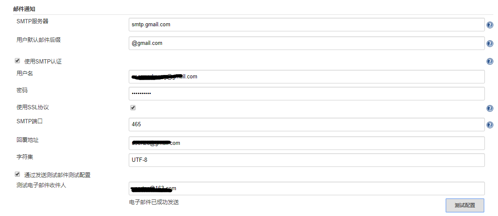
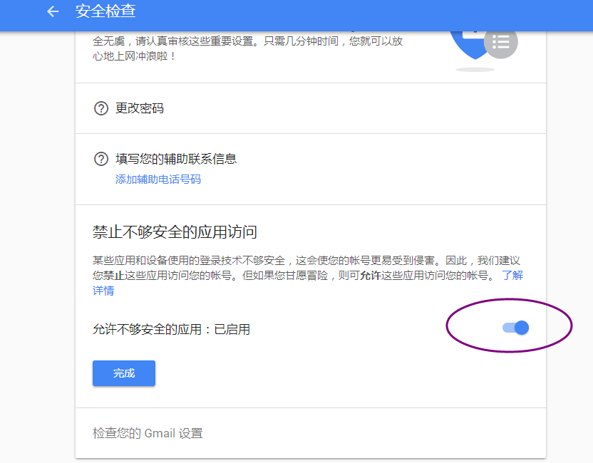
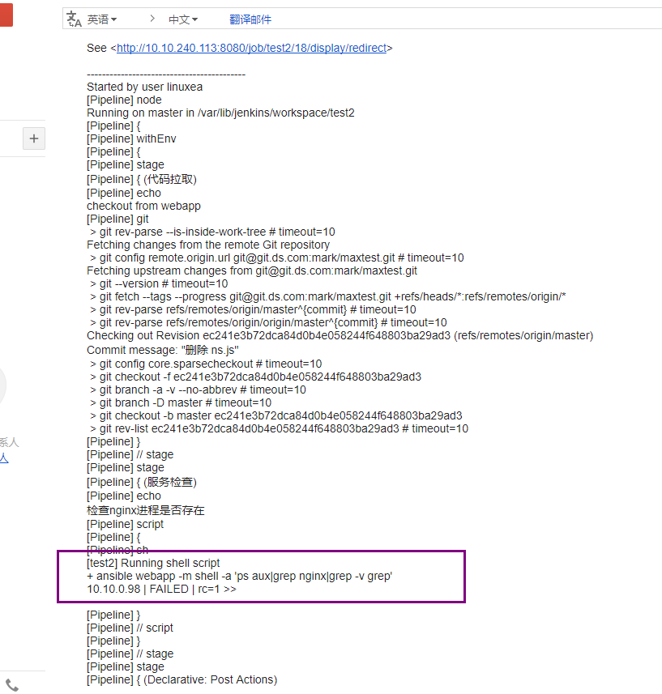
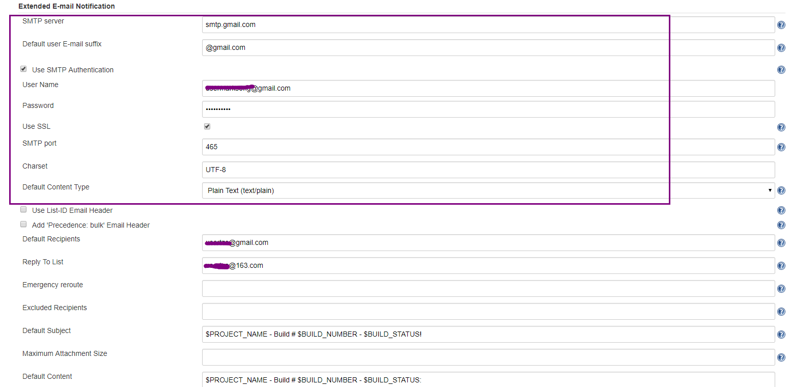
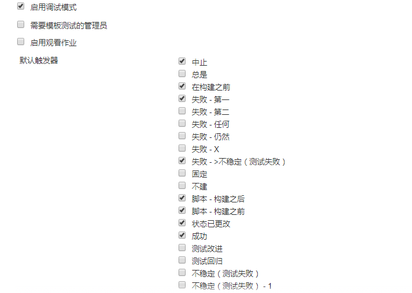
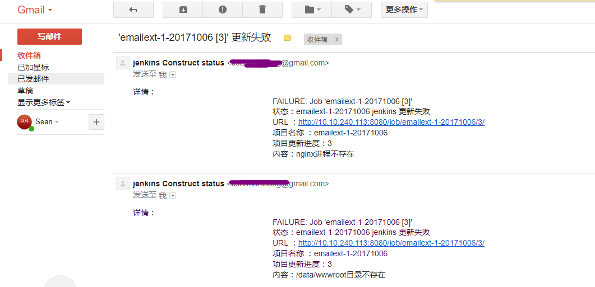

可以通过Mailer Plugin和Email-ext plugin插件发送邮件
在pipeline中可以在执行完成进行，通过直接的结果发送失败或者成功，也可以在执行阶段过程中，如果在那个阶段执行失败发送，想看第一中，只发送失败的详细结果：
异常处理参考：`https://jenkins.io/doc/pipeline/steps/workflow-basic-steps/`						`https://jenkins.io/doc/book/pipeline/syntax/`

[TOC]

## Mailer Plugin邮件设置
安装Mailer Plugin插件
### 1，jenkins邮箱配置
系统管理-->系统设置
使用的gmail邮箱，添加置如下

*  注意  这里需要开启允许不够安全的应用如下：
### 2，gmail配置

### 3，post字段
加入如下字段
```
   post {
        always {
          step([$class: 'Mailer',
            notifyEveryUnstableBuild: true,
            recipients: "myname@gmail.com",
            sendToIndividuals: true])
        }
    }
```
### 4，pipeline文件测试
```
pipeline {
	agent any
	environment { 
	def ITEMNAME = "webapp"
	def DESTPATH = "/data/wwwroot"
	def SRCPATH = "~/workspace/test"
	def BUILD_USER = "mark"
	}
	
	stages {	
		stage('代码拉取'){
			steps {
			echo "checkout from ${ITEMNAME}"
			git url: 'git@git.ds.com:mark/maxtest.git', branch: 'master'
			//git credentialsId:CRED_ID, url:params.repoUrl, branch:params.repoBranch
					}
					}	
		stage('服务检查') {
			steps {
				echo "检查nginx进程是否存在"
				script{
					def resultUpdateshell = sh script: 'ansible webapp -m shell -a "ps aux|grep nginx|grep -v grep"'
					currentBuild.result = 'FAILED'
					if (resultUpdateshell == 0) {
						skip = '0'
						return
					}	
					}
					}
					}		
		}
   post {
        always {
          step([$class: 'Mailer',
            notifyEveryUnstableBuild: true,
            recipients: "myname@gmail.com",
            sendToIndividuals: true])
        }
    }
}
```

这个简单的pipeline中我将nginx关闭，执行就会发送邮件

这样的 邮件需要观察是否哪里出现问题
###  阶段邮件
### 1，方式一
也可以在每个阶段进行添加，像这样
```
		stage('服务检查') {
			steps {
				echo "检查nginx进程是否存在"
				script{
					try {
						sh script: 'ansible webapp -m shell -a "ps aux|grep nginx|grep -v grep"'
						currentBuild.result = 'SUCCESS'
						} catch (any) {
						currentBuild.result = 'FAILURE'
						throw any
						} finally {
						println currentBuild.result 
						step([$class: 'Mailer',
						notifyEveryUnstableBuild: true,
						recipients: "myname@gmail.com",
						sendToIndividuals: true])					
						}
						}
						}
						}
```
###  2，方式2
或者这样
```
		stage('服务检查') {
			steps {
				echo "检查nginx进程是否存在"
				script{
					catchError  {
						sh script: 'ansible webapp -m shell -a "ps aux|grep nginx|grep -v grep"'
						} 
						step([$class: 'Mailer',
						notifyEveryUnstableBuild: true,
						recipients: "myname@gmail.com",
						sendToIndividuals: true])					
				}
				}
				}
```
### 3，预览
完整的预览就是这样
```
pipeline {
	agent any
	environment { 
	def ITEMNAME = "webapp"
	def DESTPATH = "/data/wwwroot"
	def SRCPATH = "~/workspace/test"
	def BUILD_USER = "mark"
	}
	
	stages {	
		stage('代码拉取'){
			steps {
			echo "checkout from ${ITEMNAME}"
			git url: 'git@git.ds.com:mark/maxtest.git', branch: 'master'
			//git credentialsId:CRED_ID, url:params.repoUrl, branch:params.repoBranch
					}
					}	
		stage('服务检查') {
			steps {
				echo "检查nginx进程是否存在"
				script{
					catchError  {
						sh script: 'ansible webapp -m shell -a "ps aux|grep nginx|grep -v grep"'
						} 
						step([$class: 'Mailer',
						notifyEveryUnstableBuild: true,
						recipients: "myname@gmail.com",
						sendToIndividuals: true])					
				}
				}
				}
				}
				}
```

但是这样还是会有问题，如果构建正常，不会发送邮件，只有构建出错才会发送，我们希望每个阶段如果构建错误这发送错误的邮件，如果没有错误则发送构建完成这样的字样，那可以这样
## Email-ext plugin插件
### 1，插件配置
安装完成后打开配置页面，系统管理-->系统设置

启用调试模式。Enable Debug Mode，默认的触发器也可以勾选

参考：`https://wiki.jenkins.io/display/JENKINS/Email-ext+plugin#Email-extplugin-TemplateExamples`
### 2，配置参考
post返回success/failure也会发送邮件，这样你会收到两份邮件，正常和失败的，如下：

```
post {
		success {
			emailext (
				subject: "'${env.JOB_NAME} [${env.BUILD_NUMBER}]' 更新正常",
				body: """
				详情：
				SUCCESSFUL: Job '${env.JOB_NAME} [${env.BUILD_NUMBER}]'
				状态：${env.JOB_NAME} jenkins 更新运行正常 
				URL ：${env.BUILD_URL}
				项目名称 ：${env.JOB_NAME} 
				项目更新进度：${env.BUILD_NUMBER}
				""",
				to: "myname@gmail.com",
				recipientProviders: [[$class: 'DevelopersRecipientProvider']]
				)
				}	
		failure {
			emailext (
				subject: "'${env.JOB_NAME} [${env.BUILD_NUMBER}]' 更新失败",
				body: """
				详情：
				FAILED: Job '${env.JOB_NAME} [${env.BUILD_NUMBER}]'				
				状态：${env.JOB_NAME} jenkins 运行失败 
				URL ：${env.BUILD_URL}
				项目名称 ：${env.JOB_NAME} 
				项目更新进度：${env.BUILD_NUMBER}
				""",
				to: "myname@gmail.com",
				recipientProviders: [[$class: 'DevelopersRecipientProvider']]
				)
				}
	}
}
```
### 3，混合模式（Mailer Email-ext）
Mailer 会将pipeline执行详细内容发送到邮件，成功这只发送编辑的信息
```
pipeline {
	agent any
	environment { 
	def ITEMNAME = "webapp"
	def DESTPATH = "/data/wwwroot"
	def SRCPATH = "~/workspace/test"
	def BUILD_USER = "mark"
	}
	
	stages {	
		stage('代码拉取'){
			steps {
			echo "checkout from ${ITEMNAME}"
			git url: 'git@git.ds.com:mark/maxtest.git', branch: 'master'
			//git credentialsId:CRED_ID, url:params.repoUrl, branch:params.repoBranch
					}
					}	
		stage('服务检查') {
			steps {
				echo "检查nginx进程是否存在"
				script{
					try {
						sh script: 'ansible webapp -m shell -a "ps aux|grep nginx|grep -v grep"'
						} catch (exc) {
						currentBuild.result = "FAILURE"
						println currentBuild.result
						    step([$class: 'Mailer',
						    notifyEveryUnstableBuild: true,
						    recipients: "myname@gmail.com",
						    sendToIndividuals: true])					
						}
						}
						}
						}
						}							
	post {
		success {
			emailext (
				subject: "'${env.JOB_NAME} [${env.BUILD_NUMBER}]' 更新正常",
				body: """
				详情：
				SUCCESSFUL: Job '${env.JOB_NAME} [${env.BUILD_NUMBER}]'
				状态：${env.JOB_NAME} jenkins 更新运行正常 
				URL ：${env.BUILD_URL}
				项目名称 ：${env.JOB_NAME} 
				项目更新进度：${env.BUILD_NUMBER}
				""",
				to: "myname@gmail.com",
				recipientProviders: [[$class: 'DevelopersRecipientProvider']]
				)
				}	
	}
}
```
### 4，阶段邮件发送
在前面Mailer 已经可以实现了，但是如果pipeline过长观看不是很理想，可以这样
如果希望每个步骤如果失败则发送每一个失败的邮件提醒，如果正常也发送一封邮件提醒。不同的是内容可以自定义

```
pipeline {
	agent any
	environment { 
	def ITEMNAME = "webapp"
	def DESTPATH = "/data/wwwroot"
	def SRCPATH = "~/workspace/test"
	def BUILD_USER = "mark"
	def USERMAIL = "myname@gmail.com"
	}
	
	stages {	
		stage('代码拉取'){
			steps {
			echo "checkout from ${ITEMNAME}"
			git url: 'git@git.ds.com:mark/maxtest.git', branch: 'master'
			//git credentialsId:CRED_ID, url:params.repoUrl, branch:params.repoBranch
					}
					}	
		stage('服务检查') {
			steps {
				echo "检查nginx进程是否存在"
				script{
					try {
					sh script: 'ansible webapp -m shell -a "ps aux|grep nginx|grep -v grep"'
					} catch (exc) {
						currentBuild.result = "FAILURE"					
							emailext (
								subject: "'${env.JOB_NAME} [${env.BUILD_NUMBER}]' 更新失败",
								body: """
								详情：
								FAILURE: Job '${env.JOB_NAME} [${env.BUILD_NUMBER}]'
								状态：${env.JOB_NAME} jenkins 更新失败 
								URL ：${env.BUILD_URL}
								项目名称 ：${env.JOB_NAME} 
								项目更新进度：${env.BUILD_NUMBER}
								内容：nginx进程不存在
								""",
								to: "${USERMAIL}",
								recipientProviders: [[$class: 'DevelopersRecipientProvider']]
								)				
								} 		
					}
					}
					}
		stage('目录检查') {
			steps {
				echo "检查${DESTPATH}目录是否存在"
				script{
					try {
					sh script: 'ansible webapp -m shell -a "ls -d ${DESTPATH}"'
					} catch (exc) {
						currentBuild.result = "FAILURE"					
							emailext (
								subject: "'${env.JOB_NAME} [${env.BUILD_NUMBER}]' 更新失败",
								body: """
								详情：
								FAILURE: Job '${env.JOB_NAME} [${env.BUILD_NUMBER}]'
								状态：${env.JOB_NAME} jenkins 更新失败 
								URL ：${env.BUILD_URL}
								项目名称 ：${env.JOB_NAME} 
								项目更新进度：${env.BUILD_NUMBER}
								内容：${DESTPATH}目录不存在
								""",
								to: "${USERMAIL}",							
								recipientProviders: [[$class: 'DevelopersRecipientProvider']]
								)				
								}
					}
					}		
					}
					}
	post {
		success {
			emailext (
				subject: "'${env.JOB_NAME} [${env.BUILD_NUMBER}]' 更新正常",
				body: """
				详情：
				SUCCESSFUL: Job '${env.JOB_NAME} [${env.BUILD_NUMBER}]'
				状态：${env.JOB_NAME} jenkins 更新运行正常 
				URL ：${env.BUILD_URL}
				项目名称 ：${env.JOB_NAME} 
				项目更新进度：${env.BUILD_NUMBER}
				""",
				to: "${USERMAIL}",	
				recipientProviders: [[$class: 'DevelopersRecipientProvider']]
				)
				}
				}
}
```
